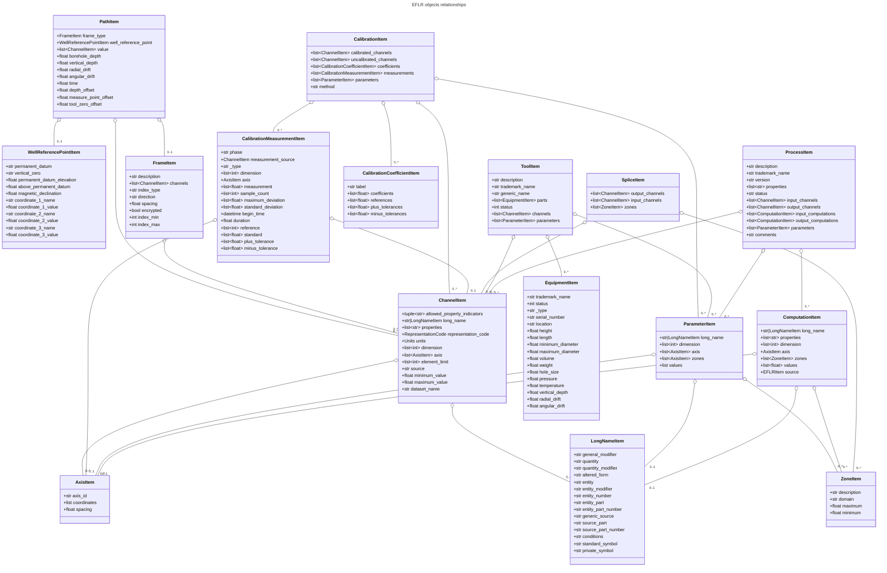
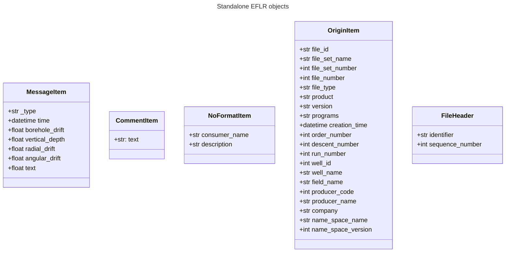
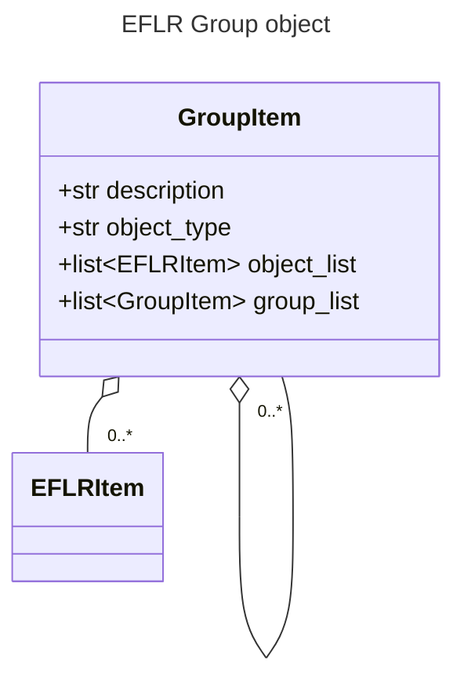
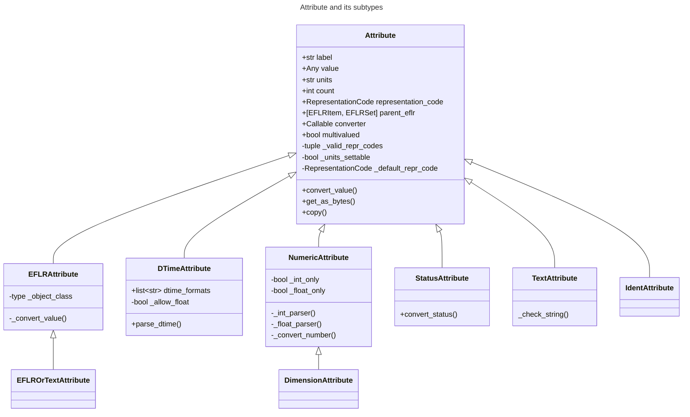

# DLIS Writer

Welcome to `dlis-writer`, possibly the only public Python library for creating DLIS files.

## Table of contents
- [User guide](#user-guide)
  - [Minimal example](#minimal-example)
  - [Extending basic metadata](#extending-basic-metadata)
  - [Adding more objects](#adding-more-objects)
  - [Example scripts](#example-scripts)
- [Developer guide](#developer-guide)
  - [Logical Records and Visible Records](#logical-records-and-visible-records) 
  - [Logical Record types](#logical-record-types)
  - [Storage Unit Label](#storage-unit-label)
  - [IFLR objects](#iflr-objects)
    - [Frame Data](#frame-data)
    - [No-Format Frame Data](#no-format-frame-data)
    - [IFLR objects and their relations to EFLR objects](#iflr-objects-and-their-relations-to-eflr-objects)
  - [EFLR objects](#eflr-objects)
    - [`EFLRSet` and `EFLRItem`](#eflrset-and-eflritem)
    - [Implemented EFLR objects](#implemented-eflr-objects)
    - [Relations between EFLR objects](#relations-between-eflr-objects)
  - [DLIS Attributes](#dlis-attributes)
    - [The `Attribute` class](#the-attribute-class)
    - [Attribute subtypes](#attribute-subtypes)
  - [Writing the binary file](#writing-the-binary-file)
    - [`DLISFile` object](#dlisfile-object)
    - [Ways of passing data](#ways-of-passing-data)
    - [`FileLogicalRecords` and `MultiFrameData`](#filelogicalrecords-and-multiframedata)
    - [`DLISWriter` and auxiliary objects](#dliswriter-and-auxiliary-objects)
    - [Converting objects and attributes to bytes](#converting-objects-and-attributes-to-bytes)
    - [Writer configuration](#writer-configuration)


---
## User guide
In the sections below you can learn how to define and write a DLIS file using the `dlis-writer`.

### Minimal example
Below you can see a very minimal DLIS file example with two 1D channels (one of which serves as the index)
and a single 2D channel.

```python
import numpy as np  # for creating mock datasets
from dlis_writer.file import DLISFile  # the main dlis-writer object you will interact with

# create a DLISFile object
# this also initialises Storage Unit Label and File Header with minimal default information
df = DLISFile()

# add Origin
df.add_origin("MY-ORIGIN")

# number of rows for creating the datasets
# all datasets (channels) belonging to the same frame must have the same number of rows
n_rows = 100

# define channels with numerical data and additional information
#  1) the first channel is also the index channel of the frame;
#     must be 1D, ideally should be monotonic and equally spaced
ch1 = df.add_channel('DEPTH', data=np.arange(n_rows) / 10, units='m')

#  2) second channel; in this case 1D and unitless
ch2 = df.add_channel("RPM", data=(np.arange(n_rows) % 10).astype(float))

#  3) third channel - an image channel (2D data)
ch3 = df.add_channel("AMPLITUDE", data=np.random.rand(n_rows, 5))

# define frame, referencing the above defined channels
main_frame = df.add_frame("MAIN-FRAME", channels=(ch1, ch2, ch3), index_type='BOREHOLE-DEPTH')

# when all the required objects have been added, write the data and metadata to a physical DLIS file
df.write('./new_dlis_file.DLIS')

```

### Extending basic metadata
As mentioned above, initialising `DLISFile` object automatically constructs Storage Unit Label,
and File Header. However, the definition of each of these can be further tuned.
The same applies to Origin, which is the container for key meta-data concerning the well, company, operation set-up etc.

```python
from dlis_writer.file import DLISFile

# define DLISFile passing more information for creating Storage Unit Label and File Header
df = DLISFile(
  set_identifier="MY-SET",
  sul_sequence_number=5,
  max_record_length=4096,
  fh_id="MY-FILE-HEADER",
  fh_sequence_number=8
)

# add Origin with more details
# see more available keyword arguments in DLISFile.add_origin()
origin = df.add_origin(
  'MY-ORIGIN',
  file_id='MY-FILE-ID',
  file_set_name='MY-FILE-SET-NAME',
  file_set_number=11,
  file_number=22,
  well_id=55,
  well_name='MY-WELL'
)

```

The attributes can also be changed later by accessing the relevant objects's attributes.
Note: because most attributes are instances of [`Attribute` class](#the-attribute-class),
you will need to use `.value` (or `.unit`) of the attribute you may want to change.

```python
origin.company.value = "COMPANY X" 
```

### Adding more objects
Adding other logical records to the file is done in the same way as adding channels and frames.
For example, to add a zone (in depth or in time):

```python
zone1 = df.add_zone('DEPTH-ZONE', domain='BOREHOLE-DEPTH', minimum=2, maximum=4.5)
zone2 = df.add_zone('TIME-ZONE', domain='TIME', minimum=10, maximum=30)
```

To specify units for numerical values, use `.units` of the relevant attribute, e.g.
```python
zone1.minimum.units = 'in'  # inches  
zone2.maximum.units = 's'   # seconds
```

As per the [logical records relations graph](#relations-between-eflr-objects),
Zone objects can be used to define e.g. Splice objects (which also refer to Channels):

```python
splice1 = df.add_splice('SPLICE1', input_channels=(ch1, ch2), output_channel=ch3, zones=(zone1, zone2))
```

For more objects, see [the example with all kinds of objects](./examples/create_synth_dlis.py)
and [the description of all implemented objects](#implemented-eflr-objects).

Definition of all additional objects should precede the call to `.write()` of `DLISFile`, 
otherwise no strict order is observed.

### Example scripts
Scripts in the [examples](./examples) folder illustrate the basic usage of the library.

- [create_synth_dlis.py](./examples/create_synth_dlis.py) shows how to add every kind 
of DLIS object to the file - including Parameters, Equipment, Comments, No-Formats, etc.
It is also shown how multiple frames (in this case, a depth-based and a time-based frame) can be defined.

- [create_dlis_from_data.py](./examples/create_dlis_from_data.py) can be used to make a DLIS file
from any HDF5 data source.

- [create_synth_dlis_variable_data.py](./examples/create_synth_dlis_variable_data.py) allows creating DLIS files
with any number of 2D datasets with a user-defined shape, filled with randomised data. 


Furthermore, scripts contained in the [file_format_converter](./src/dlis_writer/file_format_converter) 
subpackage can be used to create DLIS files from a number of different input data formats 
(including hdf5, csv, and las.)

---
## Developer guide
...


#### Relations between EFLR objects
Many of the EFLR objects are interrelated - e.g. a Frame refers to multiple Channels,
each of which can have an Axis; a Calibration uses Calibration Coefficients and Calibration Measurements;
a Tool has Equipments as parts. The relations are summarised in the diagram below.

_*Note*: in the diagrams below, the description of [`Attribute`s](#dlis-attributes) of the objects has been simplified.
Only the type of the `.value` part of each `Attribute` is shown - e.g. in `CalibrationItem`, 
`calibrated_channels` is shown as a list of `ChannelItem` instances, where in fact it is 
an [`EFLRAttribute`](#attribute-subtypes) whose `.value` takes the form of a list of `ChannelItem` objects._ 



Other EFLR objects can be thought of as _standalone_ - they do not refer to other EFLR objects 
and are not explicitly referred to by any (although - as in case of NoFormat - a relation to IFLR objects can exist).



A special case is a Group object, which can refer to any other EFLRs or other groups, as described [here](#group).




### DLIS Attributes
The characteristics of EFLR objects of the DLIS are defined using instances of `Attribute` class.
An `Attribute` holds the value of a given parameter together with the associated unit (if any)
and a representation code which guides how the contained information is transformed to bytes.
Allowed units (not a strict set) and representation codes are defined [in the code](./src/dlis_writer/utils/enums.py)
(although explicit setting of representation codes is no longer possible).

As a rule, `Attribute`s are defined for `EFLRItem`s, instances of which populate the `Attribute`s
with relevant values. When an `EFLRItem` is converted to bytes, it includes information from all its
`Attributes`. However, the defined `Attribute` information is also needed in `EFLRSet`s in order to define
a header for all `EFLRItem`s it contains. For this reason, when the first `EFLRItem` instance for a given
`EFLRSet` is created, the `Attribute`s from this `EFLRItem` are copied and passed to `ELFRSet`.

#### The `Attribute` class
The main characteristics of `Attribute` are described below.

- `label`: The name of the `Attribute`. Comes from the standard and should not be changed.
- `value`: The value(s) specified for this `Attribute`. In general, any type is allowed, but in most cases it is
  (a list of): str / int / float / `EFLRItem` / `datetime`.
- `multivalued`: a Boolean indicating whether this `Attribute` instance accepts a list of values (if True) or a single 
  value (if False). Specified at initialisation of the `Attribute` (which usually takes place at initialisation of the 
  relevant EFLR object).
- `count`: Number of values specified for the `Attribute` instance. If the `Attribute` is not `multivalued`, `count` is 
  always 1. Otherwise, it is the length of the list of values added to the `Attribute` (or `None` if no value is given).
- `units`: A string representing the units of the `value` of the `Attribute` - if relevant. The standard pre-defines
  a list of allowed units, but many DLIS readers accept any string value. For this reason, only a log warning is issued
  if the user specifies a unit other than those given by the standard. 
- `representation_code`: indication of type of the value(s) of the `Attribute` and guidance on how they should be 
  converted to bytes to be included in the file. Representation codes are either defined when the Attribute 
  is initialised or are inferred from the provided value(s). They are not settable by the user.
- `parent_eflr`: The `EFLRItem` or `EFLRSet` instance this attribute belongs to. Mainly used for string representation
  of the `Attribute` (e.g. `Attribute 'description' of ToolItem 'TOOL-1'`, where `TOOL-1` is the parent EFLR).
- `converter`: A callable which is used to convert the value passed by the user (or each of the individual items 
  if the `Attribute` is multivalued) to fit the standard-imposed requirements for the given `Attribute`. It can also 
  include type checks etc. (for example, checking that the objects passed to `calibrated_channels` of `CalibrationItem`)
  are all instances of `ChannelItem`.

_Settable_ parts of `Attribute` instance include: `value`, `units`, and `converter`. 
Some subtypes of `Attribute` further restrict what can be set.


#### Attribute subtypes
Several `Attribute` subclasses have been defined to answer the reusable characteristics of the 
attributes needed for various EFLR objects. The overview can be seen in the diagram below.



`EFLRAttribute` has been defined to deal with attributes which should keep reference to other
`EFLRItem`s - for example, `Channel`s of `Frame`, `Zones` of `Splice`, 
`CalibrationCoefficient`s and `CalibrationMeasurement`s of `Calibration`.
The value of an `EFLRAttribute` is an instance of (usually specific subtype of) `EFLRItem`.
The representation code can be either `OBNAME` or `OBJREF`. The unit should not be defined (is meaningless).
Its subclass, `EFLROrTextAttribute`, is similar, but in addition accepts plain text as value
(represented as `ASCII`). This subclass is meant for the _long-name_ attribute of [Channel](#channel), 
[Process](#process), and [Computation](#computation); the value of this attribute can be either text 
or a [`LongNameItem` object](#long-name).

`DTimeAttribute` is meant for keeping time reference, either in the form of a `datetime.datetime` object
or a number, indicating time since a specific event. The representation code is adapted
to the value: `DTIME` for `datetime` objects, otherwise any numeric code (e.g. `FDOUBl`, `USHORT`, etc.)
The unit should be defined if the value is a number and should express the unit of time
('s' for seconds, 'min' for minutes, etc.).

`NumericAttribute` keeps numerical data - in the form of int(s) or float(s). It is possible
to restrict the type of accepted values to ints only or floats only at initialisation of the attribute.

`DimensionAttribute` is a subclass of `NumericAttribute`. It limits the above to ints only and is always
multivalued (always a list of integers). It is mainly used in [Channel](#channel) objects where it describes
the shape of the data (only the width, i.e. the number of columns).

`StatusAttribute` encodes the status of [Tool](#tool) and [Equipment](#equipment) objects. 
Its value can only be 0 or 1.

### Writing the binary file
The objects described above are Python representation of the information to be included in a DLIS file.
Subsections below explain how these objects are converted to bytes, which then become a part of the created file.

#### `DLISFile` object
The [`DLISFile` class](./src/dlis_writer/file/file.py), as shown in the [User guide](#user-guide),
is the main point of the user's interaction with the library.
It facilitates defining a (future) file with all kinds of EFLR and IFLR objects and the relations between them.

The interface was initially inspired by that of `h5py`, in particular the HDF5-writer part of it:
the _child_ objects (e.g. HDF5 _datasets_) can be created and simultaneously linked to the _parent_ objects 
(e.g. HDF5 _groups_) by calling a relevant method of the parent instance like so:

```python
new_h5_dataset = some_h5_group.add_dataset(...)
```

However, while the HDF5 structure is strictly hierarchical, the same cannot be said about DLIS.
For example, the same Zone can be referenced by multiple Splices, Parameters, and Computations.
It is also possible to add any object without it referencing or being referenced by other objects.
This is the case both for _standalone_ objects, such as Message or Comment, and the 
potentially interlinked objects, such as Zone or Parameter. 
(Note: adding a standalone Channel object is possible, but is known to cause issues in some readers, e.g. _DeepView_.)
For this reason, in the `dlis-writer` implementation, adding objects in the `h5py` manner is only possible 
from the top level - a `DLISFile`:

```python
dlis_file = DLISFile()
a_channel = dlis_file.add_channel(...)
an_axis = dlis_file.add_axis(...)
```

In order to mark relations between objects, a 'lower-level' object should be created first and then
passed as argument when creating a 'higher-level' object:

```python
a_frame = dlis_file.add_frame(..., channels=(a_channel, ...))   # frame can have multiple channels
a_computation = dlis_file.add_computation(..., axis=an_axis)    # computation can only have 1 axis
```

This makes it trivial to reuse already defined 'lower-level' objects as many times as needed:

```python
# (multiple axes possible for both Parameter and Channel)
a_param = dlis_file.add_parameter(..., axis=(an_axis, ...))  
another_channel = dlis_file.add_channel(..., axis=(an_axis, ...))
```

As shown in the [User guide](#user-guide), once all required objects are defined,
the `write()` method of `DLISFile` can be called to generate DLIS bytes and store them in a file.
The `write()` method first transforms the data into a [`FileLogicalRecords`](#filelogicalrecords-object) object,
which is then passed to [`DLISWriter`](#dliswriter-and-auxiliary-objects), responsible for writing the file.

#### Ways of passing data
Data associated with the file's Channels can be passed when adding a Channel to teh `DLISFile` instance.
Data added in this way is stored in an internal dictionary, mapped by the Channels' names.

However, it is also possible to pass the data later, when calling the `write()` method
of the `DLISWriter`. The passed data can be of one of the following forms:
- A dictionary of `numpy.ndarray`s (1D or 2D, depending on the Channel configuration).
  The keys of the dictionary must match the `dataset_name`s of the Channels added to the file.
  (If not explicitly specified, the `dataset_name` of a Channel is the same as its name.)
- A structured numpy.ndarray, whose _dtype names_ match the `dataset_name`s of the Channels.
- A path to an HDF5 file, containing the relevant datasets. In this case, the Channels' `dataset_name`s
  must define the full internal paths to the datasets starting from the root of the file - e.g.
  `/contents_root/general_group/specific_group/the_dataset`.

Note: even if multiple Frames are defined, the data object passed to the `write()` call should contain
all datasets to be included in the file. The correct arrangement of the datasets is done internally
at a later stage. The data is also allowed to contain datasets not to be used in the file;
these will simply be ignored. However, the writing cannot be done if data for any of the Channels are missing.

When a [`FileLogicalRecords`](#filelogicalrecords-and-multiframedata) object is created,
the data are wrapped in a [`SourceDataWrapper`](./src/dlis_writer/utils/source_data_wrappers.py),
in particular one of its subclasses - designed for handling dict, `numpy.ndarray`, or HDF5 data.
The main objectives of these objects are:
- ensuring the correct structure (order of channels etc.) of the data when [`FrameData`](#frame-data) instances
  are created
- loading the source data in chunks rather than the entire data at a time to address memory limitations.

Note that because creating the required structure is the responsibility of the library,
not the user, it is assumed that the provided data will not match the needed structure.
In order to create the (chunks of) structured numpy array needed for Frame Data, the source data must be copied.
The `SourceDataWrapper` objects copy only as much data as are needed to define a single data chunk for writing.
When that chunk is exhausted, the 'used' data are discarded and a new chunk is loaded.

The size of the input data chunk is defined in number of rows of the data table.
It can be controlled by setting `input_chunk_size` in the `write()` call of the `DLISFile`.
The optimal value varies depending on the structure of the data (number & widths of the individual datasets)
as well as the hardware configuration.

#### `FileLogicalRecords` and `MultiFrameData`
The role of `FileLogicalRecords` is to define an iterable of all logical records
to be included in the final DLIS file, in a correct order.

`DLISFile` is used to define the structure of the file. Numerical data, associated with
the channels, can be provided either at channel creation or later, 
[when `write()` is called](#passing-data-at-the-write-call).
On the other hand, `FileLogicalRecords` object is created with the assumption that data
are available, so that relevant [Frame Data (IFLR)](#frame-data) objects can be defined.

`FileLogicalRecords` uses `MultiFrameData` objects which combine the Frame, Channels, and
numerical data information. These objects are also iterable and yield consecutive instances 
of Frame Data belonging to the given Frame. One `MultiFrameData` object per frame is defined.

#### `DLISWriter` and auxiliary objects
`DLISWriter` is the object where the bytes creation and writing to file happens.
Given the iterable of logical records, enclosed in a `FileLogicalRecords` object,
a `DLISWriter` iterates over the logical records and for each one:
  1. Assigns an _origin_reference_ to all objects in the file.
    The origin reference is the `file_set_number` of the Origin object defined in the file.
  2. Calls for creation of bytes describing that logical record 
       (see [here](#converting-objects-and-attributes-to-bytes))
  3. If the bytes sequence is too long to fit into a single visible record,
       it splits the bytes into several segments (see [the explanation](#logical-records-and-visible-records))
  4. Wraps the segments (or full bytes sequence) in visible records and writes the resulting bytes to a file.

The writing of bytes is aided by objects of two auxiliary classes: `ByteWriter` and `BufferedOutput`.
The main motivation between both is to facilitate gradual, _chunked_ writing of bytes to a file
rather than having to keep everything in memory and dumping it to the file at the very end.

`ByteWriter` manages access to the created DLIS file. Its `write_bytes` method,
which can be called repetitively, writes or appends the provided bytes to the file.
The object also keeps track of the total size (in bytes) of the file as it is being created.

The role of `BufferedOutput` is to gather bytes of the created visible records
and periodically call the `write_bytes` of the `ByteWriter` to send the collected
bytes to the file and clear its internal cache, getting ready for receiving more bytes.
The size of the gathered bytes chunk is user-tunable through `output_chunk_size` argument to the
`write()` method of the [`DLISFile`](#dlisfile-object). 
It can be adjusted to tackle the tradeoff between the amount of data stored in memory at any given point
and the number of I/O calls.

#### Converting objects and attributes to bytes
The way in which different objects are converted to DLIS-compliant bytes
depends on the category these objects fall into, according to the earlier specified
[division](#logical-record-types).

- [Storage Unit Label](#storage-unit-label) has its own predefined bytes structure of fixed length.
  Its content varies minimally, taking into account the parameters specified at its creation,
  such as visible record length, storage set identifier, etc.
- The main part of [Frame Data (IFLR)](#frame-data) - the numerical data associated with the Channels - is stored
  in the object as a row od a structured `numpy.ndarray`. Each entry of the array is converted to
  bytes using the `numpy`'s built-in `tobytes()` method (with additional `byteswap()` call before that 
  to account for the big-endianness of DLIS). Additional bytes referring to the [Frame](#frame) 
  and the index of the current Frame Data in the Frame are added on top.
- In [No-Format Frame Data](#no-format-frame-data), the _data_ part can be already expressed as bytes,
  in which case it is used as-is. Otherwise, it is assumed to be of string type and is encoded as ASCII.
  A reference to the parent [No-Format](#no-format) object is added on top.
- [EFLR objects](#eflrset-and-eflritem) are treated per `EFLRSet` instance.
  - First, bytes describing the `EFLRSet` instance are made, including its `set_type`
    and `set_name` (if present).
  - Next, _template_ bytes are added. These specify the order and names of [`Attribute`s](#dlis-attributes)
    characterising the `EFLRItem` instances belonging to the given `EFLRSet`.
  - Finally, each of the `EFLRItem`'s bytes are added. Bytes of an `EFLRItem` instance consist of
    its name + _origin reference_ + _copy number_ description, followed by the values and other characteristics
    (units, repr. codes, etc.) of each of its `Attribute`s in the order specified in the 
    `EFLRSet`'s _template_.
