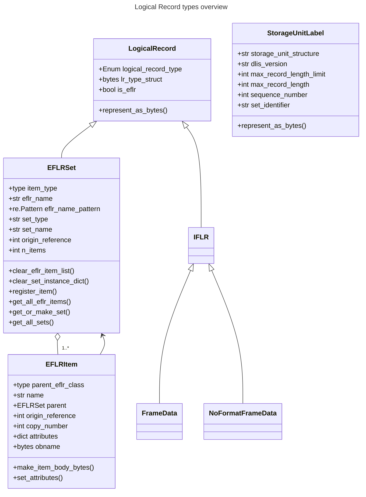
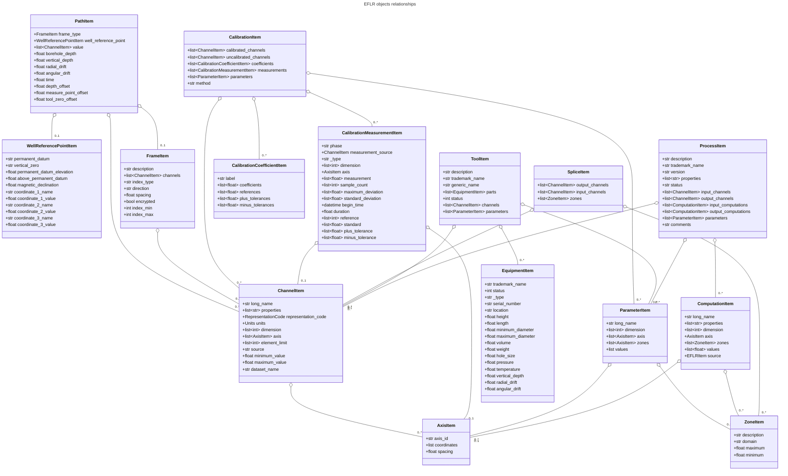
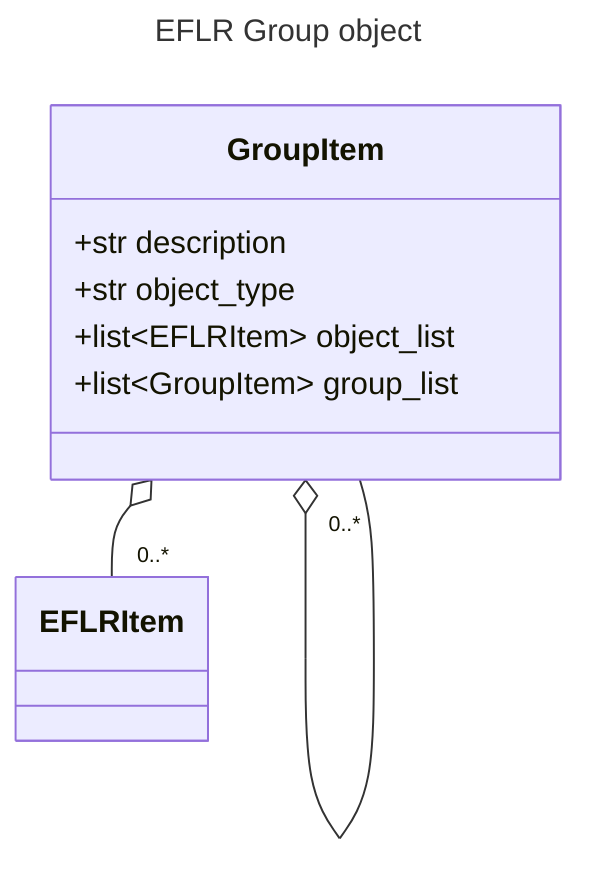
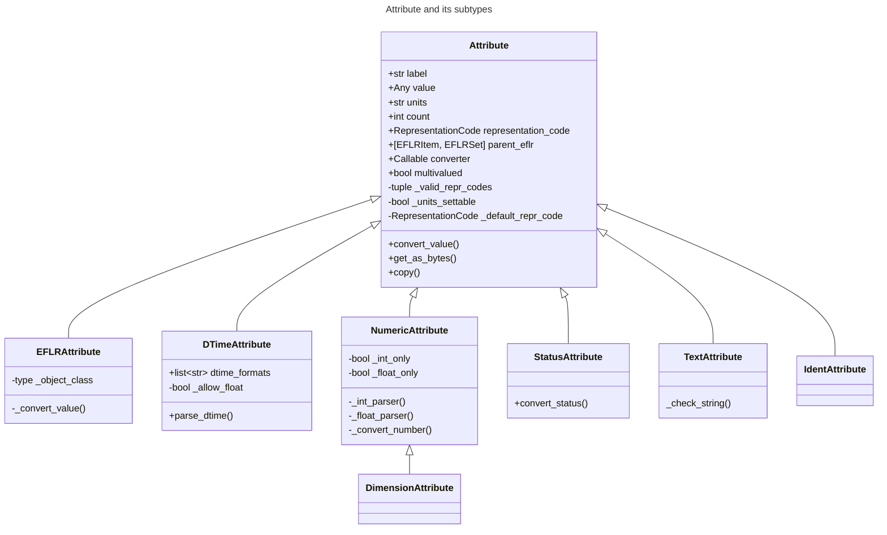

# DLIS Writer

Welcome to `dlis-writer`, possibly the only public Python library for creating DLIS files.

## Table of contents
- [Release log](#release-log)
- [About the DLIS format](#about-the-dlis-format)
- [User guide](#user-guide)
  - [Minimal example](#minimal-example)
  - [Extending basic metadata](#extending-basic-metadata)
  - [Adding more objects](#adding-more-objects)
  - [Example scripts](#example-scripts)
- [Developer guide](#developer-guide)
  - [Logical Records and Visible Records](#logical-records-and-visible-records) 
  - [Logical Record types](#logical-record-types)
  - [Storage Unit Label](#storage-unit-label)
  - [IFLR objects](#iflr-objects)
    - [Frame Data](#frame-data)
    - [No-Format Frame Data](#no-format-frame-data)
    - [IFLR objects and their relations to EFLR objects](#iflr-objects-and-their-relations-to-eflr-objects)
  - [EFLR objects](#eflr-objects)
    - [`EFLRSet` and `EFLRItem`](#eflrset-and-eflritem)
    - [Implemented EFLR objects](#implemented-eflr-objects)
    - [Relations between EFLR objects](#relations-between-eflr-objects)
  - [DLIS Attributes](#dlis-attributes)
    - [The `Attribute` class](#the-attribute-class)
    - [Attribute subtypes](#attribute-subtypes)
  - [Writing the binary file](#writing-the-binary-file)
    - [`DLISFile` object](#dlisfile-object)
    - [Ways of passing data](#ways-of-passing-data)
    - [`FileLogicalRecords` and `MultiFrameData`](#filelogicalrecords-and-multiframedata)
    - [`DLISWriter` and auxiliary objects](#dliswriter-and-auxiliary-objects)
    - [Converting objects and attributes to bytes](#converting-objects-and-attributes-to-bytes)
    - [Writer configuration](#writer-configuration)


---
## Release log
##### 0.0.9 Processing input files (pending)
- Scripts to create basic DLIS files from hdf5, csv, xls(x), and las files.

##### 0.0.8 API improvements & fixes
- Removed representation code setters from `Attribute`.
- More value type and representation code (repr code inferred from value) checks.
- Setting up `Attribute`s' values and units together using `dict` or a new `AttrSetup` class.
- `DLISFile`: `add_origin` method; origin instance or setup keywords no longer accepted in `DLISFile` init.
- Support for defining multiple dlis files within one session (script).
- Removed logging formatting from library root.
- Exposed most frequently needed objects for import from library root (`from dlis_writer import ...`).
- Explicit init arguments and docstrings for most frequently used classes.
- Saving date-time in GMT rather than 'local time'.
- Passing file header and storage unit label initialisation arguments directly to `DLISFile`.
- General refactoring & typing fixes.

##### 0.0.7 Equivalent (_parallel_) frames
Made it easier to add frames with the same set of channel (dataset) names, but separate data - e.g. 
two of each: DEPTH, RPM, and AMPLITUDE, coming from two separate measurements, 
associated with relevant frames (FRAME_1, FRAME_2).
See [this example](./examples/create_dlis_equivalent_frames.py).

##### 0.0.6 Representation codes
Fixed representation codes for numpy dtypes.
Tests & improvements for utils (repr code converter, source data wrappers, etc.).

##### 0.0.5: Cleanup
Some name changes, restructuring. Updated README.

##### 0.0.4: All DLIS objects added
Exposed all types of DLIS objects (WellReferencePoint, Group, Message, etc.) 
in `DLISFile` through `add_<object>` methods (e.g. `add_group`).

##### 0.0.3: Instantiating ELFRObjects directly
Each `EFLRObject` (later renamed to `EFLRInstance`) can be initialised directly by calling the constructor
of the relevant class (before they were initialised through the corresponding `EFLR`, later renamed to `EFLRSet`).

##### 0.0.2: More DLIS objects
Added support for more objects (Zone, Splice, Axis) to the `DLISFile`.

##### 0.0.1: First release
New structure of the repository, compliant with WellID standards.

---
## About the DLIS format
DLIS (Digital Log Information Standard) is a binary data format dedicated to storing well log data. 
It was developed in the 1980's, when data were stored on magnetic tapes.
Despite numerous advances in the field of information technology, DLIS is still prevalent in the oil and gas industry.

A DLIS file is composed of _logical records_ - topical units containing pieces of data and/or metadata. 
There are multiple subtypes of logical records which are predefined for specific types of (meta)data.
The most important ones are mentioned below, with links to more extensive descriptions 
in the [Developer guide](#developer-guide).

Every DLIS file starts with a logical record called [_Storage Unit Label (SUL)_](#storage-unit-label),
followed by a [_File Header_](#file-header). Both of these mainly contain format-specific metadata.

A file must also have at least one [_Origin_](#origin), which holds the key information 
about the scanned well, scan procedure, producer, etc.

Numerical data are kept in a [_Frame_](#frame), composed of several [_Channels_](#channel).
A channel can be interpreted as a single curve ('column' of data) or a single image (2D data).

Additional metadata can be specified using dedicated logical records subtypes, 
such as [Parameter](#parameter), [Zone](#zone), [Calibration](#calibration), [Equipment](#equipment), etc.
See [the list](#implemented-eflr-objects) for more details. 
Additionally, for possible relations between the different objects, 
see the relevant [class diagrams](#relations-between-eflr-objects).

---
## User guide
In the sections below you can learn how to define and write a DLIS file using the `dlis-writer`.

### Minimal example
Below you can see a very minimal DLIS file example with two 1D channels (one of which serves as the index)
and a single 2D channel.

```python
import numpy as np  # for creating mock datasets
from dlis_writer.file import DLISFile  # the main dlis-writer object you will interact with

# create a DLISFile object
# this also initialises Storage Unit Label and File Header with minimal default information
df = DLISFile()

# add Origin
df.add_origin("MY-ORIGIN")

# number of rows for creating the datasets
# all datasets (channels) belonging to the same frame must have the same number of rows
n_rows = 100

# define channels with numerical data and additional information
#  1) the first channel is also the index channel of the frame;
#     must be 1D, ideally should be monotonic and equally spaced
ch1 = df.add_channel('DEPTH', data=np.arange(n_rows) / 10, units='m')

#  2) second channel; in this case 1D and unitless
ch2 = df.add_channel("RPM", data=(np.arange(n_rows) % 10).astype(float))

#  3) third channel - an image channel (2D data)
ch3 = df.add_channel("AMPLITUDE", data=np.random.rand(n_rows, 5))

# define frame, referencing the above defined channels
main_frame = df.add_frame("MAIN-FRAME", channels=(ch1, ch2, ch3), index_type='BOREHOLE-DEPTH')

# when all the required objects have been added, write the data and metadata to a physical DLIS file
df.write('./new_dlis_file.DLIS')

```

### Extending basic metadata
As mentioned above, initialising `DLISFile` object automatically constructs Storage Unit Label,
and File Header. However, the definition of each of these can be further tuned.
The same applies to Origin, which is the container for key meta-data concerning the well, company, operation set-up etc.

```python
from dlis_writer.file import DLISFile

# define DLISFile passing more information for creating Storage Unit Label and File Header
df = DLISFile(
  set_identifier="MY-SET",
  sul_sequence_number=5,
  max_record_length=4096,
  fh_identifier="MY-FILE-HEADER",
  fh_sequence_number=8 
)

# add Origin with more details
# see more available keyword arguments in DLISFile.add_origin()
origin = df.add_origin(
  'MY-ORIGIN',
  file_id='MY-FILE-ID',
  file_set_name='MY-FILE-SET-NAME',
  file_set_number=11,
  file_number=22,
  well_id=55,
  well_name='MY-WELL'
)

```

The attributes can also be changed later by accessing the relevant objects's attributes.
Note: because most attributes are instances of [`Attribute` class](#the-attribute-class),
you will need to use `.value` (or `.unit`) of the attribute you may want to change.

```python
origin.company.value = "COMPANY X" 
```

### Adding more objects
Adding other logical records to the file is done in the same way as adding channels and frames.
For example, to add a zone (in depth or in time):

```python
zone1 = df.add_zone('DEPTH-ZONE', domain='BOREHOLE-DEPTH', minimum=2, maximum=4.5)
zone2 = df.add_zone('TIME-ZONE', domain='TIME', minimum=10, maximum=30)
```

To specify units for numerical values, use `.units` of the relevant attribute, e.g.
```python
zone1.minimum.units = 'in'  # inches  
zone2.maximum.units = 's'   # seconds
```

As per the [logical records relations graph](#relations-between-eflr-objects),
Zone objects can be used to define e.g. Splice objects (which also refer to Channels):

```python
splice1 = df.add_splice('SPLICE1', input_channels=(ch1, ch2), output_channel=ch3, zones=(zone1, zone2))
```

For more objects, see [the example with all kinds of objects](./examples/create_synth_dlis.py)
and [the description of all implemented objects](#implemented-eflr-objects).

Definition of all additional objects should precede the call to `.write()` of `DLISFile`, 
otherwise no strict order is observed.

### Example scripts
Scripts in the [examples](./examples) folder illustrate the basic usage of the library.

- [create_synth_dlis.py](./examples/create_synth_dlis.py) shows how to add every kind 
of DLIS object to the file - including Parameters, Equipment, Comments, No-Formats, etc.
It is also shown how multiple frames (in this case, a depth-based and a time-based frame) can be defined.

- [create_dlis_from_data.py](./examples/create_dlis_from_data.py) can be used to make a DLIS file
from any HDF5 data source.

- [create_synth_dlis_variable_data.py](./examples/create_synth_dlis_variable_data.py) allows creating DLIS files
with any number of 2D datasets with a user-defined shape, filled with randomised data. 


Furthermore, scripts contained in the [file_format_converter](./src/dlis_writer/file_format_converter) 
subpackage can be used to create DLIS files from a number of different input data formats 
(including hdf5, csv, and las.)

---
## Developer guide
This section describes the `dlis-writer` implementation in more detail.
The different types of logical records are explained.
Further, the principles of converting the Python objects to DLIS-compliant bytes are described.

### Logical Records and Visible Records
[As mentioned before](#about-the-dlis-format), DLIS file consists of multiple _logical records_ (LRs).
They can be viewed as abstract units, containing a specific type of data and/or metadata.

In a more physical sense, a DLIS file is divided into _visible records_ (VRs). They are byte structures
of pre-defined format, consisting of a 4-byte header (which includes a visible record start mark and record length)
and a body (which can be filled with any bytes carrying data and/or metadata, coming from the 
logical records).

Visible records have a limited length, which is often lower than that of logical records. 
In this case, the contents of a logical record can be split among several visible records' bodies.
The _logical record segments_ (parts of the split logical record) contain additional 
header information indicating e.g. whether the given segment is the first and/or the last one 
of the original logical record.
(In case a logical record fits entirely into a single visible record, its body is also wrapped
in a logical record segment structure, with indication that the given segment is both 
the first and the last part of the original logical record.)

The maximum length of a VR is defined in [StorageUnitLabel](#storage-unit-label).
According to the standard, the minimum length is not explicitly defined, but because the
minimum length of a LR segment is 16 bytes (including 4 LR segment header bytes),
the resulting minimum length of a VR is 20 bytes.

### Logical Record types
There are two main types of logical records: [_Explicitly Formatted Logical Records (EFLRs)_](#eflr-objects)
and [_Indirectly Formatted Logical Records_ (IFLRs)](#iflr-objects). 

The [_Storage Unit Label_](#storage-unit-label), the first record in the file,
could also be viewed as a logical record. However, due to functional discrepancies, 
in the library, it does not inherit from the base `LogicalRecord` class; on the other hand,
it is implemented such that it can mock one and can be used alongside with actual `LogicalRecord` objects.

An overview of the types of logical records is shown below. More details can be found
in the three sections linked above.



### Storage Unit Label
Storage Unit Label (SUL) takes up the first 80 bytes of each DLIS file.
Its format is different from that of other logical record types.

The attribute `max_record_length` of SUL determines the maximum length allowed for visible
records of the file (see [Logical Records and Visible Records](#logical-records-and-visible-records)),
expressed in bytes. This number is limited to 16384 and the default is 8192.

### IFLR objects
_IFLR_, or _Indirectly Formatted Logical Record_ objects, are meant for keeping numerical or binary data.
There are two categories of IFLR: [_Frame Data_](#frame-data) for strictly formatted numerical data 
and [_No-Format Frame Data_](#no-format-frame-data) for arbitrary data bytes.
  
  #### Frame Data
  Each Frame Data object represents a single row of formatted numerical data. 
  The order of values in a Frame Data must follow the order of Channels in the [Frame](#frame) it references.  
  
  For example, assume a Frame has 2 channels: 1D depth channel (dimension=[1]) 
  and 2D image channel with 128 columns (dimension=[128]).
  The generated FrameData objects should contain 129 values: 
  1 from the depth channel followed by 128 from a row of the image channel. 
  The values are merged into a single, flat array.
  
  In the library, Frame Data objects are generated automatically from Frame object information and data referenced 
  by the relevant channels; see [MultiFrameData](./src/dlis_writer/file/multi_frame_data.py) for the procedure.

  #### No-Format Frame Data
  No-Format Frame Data is a wrapper for unformatted data - arbitrary bytes the user wishes to save in the file.
  It must reference a [No-Format](#no-format) object. The data - as bytes or str - should be added in the 
  `data` attribute. An arbitrary number of NOFORMAT FrameData can be created.

  #### IFLR objects and their relations to EFLR objects
  The relations of Frame Data and No-Format Frame-Data to their 'parent' EFLR objects is summarised below.
  For explanation on the differences between `FrameSet` and `FrameItem` etc., please see [here](#eflrset-and-eflritem).
  
  ```mermaid
  ---
  title: IFLR objects and their relation to EFLR objects
  ---
  classDiagram
      LogicalRecord <|-- IFLR
      LogicalRecord <|-- EFLRSet
      
      IFLR <|-- FrameData
      IFLR <|-- NoFormatFrameData
      
      EFLRSet <|-- FrameSet
      EFLRSet <|-- NoFormatSet
        
      EFLRItem <|-- FrameItem
      FrameData --> FrameItem

      EFLRItem <|-- NoFormatItem
      NoFormatFrameData --> NoFormatItem

      FrameSet o-- FrameItem
      NoFormatSet o-- NoFormatItem
      FrameItem --> FrameSet
      NoFormatItem --> NoFormatSet
      
      class FrameData{
          +FrameItem frame
          +int frame_number
          +int origin_reference
          -slots numpy.ndarray
      }
      
      class NoFormatFrameData{
          +NoFormatItem no_format_object
          +Any data
      }
  ```

### EFLR objects
_Explicitly Formatted Logical Records_ are meant for representing metadata according to pre-defined schemes.
More than 20 such schemes are defined (see [the list](#implemented-eflr-objects)).
Each one lists a specific set of attributes.
Some of the EFLRs are required for a DLIS file: [File Header](#file-header), [Origin](#origin),
[Frame](#frame), and [Channels](#channel). Others are optional ways of specifying more metadata.

#### `EFLRSet` and `EFLRItem`
The implementation of the ELFRs is split over two separate classes: `EFLRSet` and `EFLRItem`.
For the different schemes (as mentioned above), subclasses of both `EFLRSet` and `EFLRItem` are defined, 
e.g. `ChannelSet` and `ChannelItem`, `FrameSet` and `FrameItem`, etc.

`EFLRItem` is e.g. a single Channel, Frame, or Axis. 
It has its own name (the first positional argument when initialising the object) 
and a number of attributes ([`Attribute` instances](#dlis-attributes)), pre-defined by the standard.
For example, for a Channel, these attributes include: units, dimension, representation code,
minimum and maximum value, and others.

`EFLRSet` can be viewed as a collection of `EFLRItem` instances.
Because a specific subclass of `EFLRSet` (e.g. `ChannelSet`) 
can only contain instances of a specific subclass of `EFLRItem` (e.g. `ChannelItem`),
all `EFLRItem`s added to an `EFLRSet` will have exactly the same set of attribute types.
Therefore, an `EFLRSet` can be viewed as a table of `EFLRItem`s, with attribute names as table header
and individual `EFLRItem`s with their attribute values as rows in that table.

As shown in [the class diagram](#logical-record-types) above, it is `EFLRSet`, not `EFLRItem`
that inherits from `LogicalRecord` base class. While this might be non-intuitive,
it is consistent with the standard; an Explicitly Formatted Logical Record in the standard is a table
as described above, with additional metadata.

Theoretically, multiple `EFLRSet` instances of the same type (e.g. multiple `ChannelSet` instances)
can be defined in a DLIS file. The key requirement is that their names - `set_name`s - are different.
There cannot be two `ChannelItem`s (or two instances other `EFLRItem` subclass) with the same `set_name`.
However, usually only a single instance of each `EFLRSet` is defined, and the default `set_name` is `None`.

In the current implementation, there is usually no need to explicitly define `EFLRSet` (subclass) instances
or to interact with these. User is supposed to interact with the relevant `EFLRItem` subclass instead, 
e.g. `ChannelItem`. At initialisation, an instance of `ChannelItem` is automatically assigned to a `ChannelSet`.
The `set_name` argument passed to initialisation of `ChannelItem` is used to retrieve (if already defined) 
or create a `ChannelSet`. The reference to that `ChannelSet` instance is kept in the `ChannelItem` instance
in the `parent` attribute. The `ChannelItem` instance is added to a dictionary of `EFLRItem`s 
in that `ChannelSet` instance. (The same applies to all other subtypes of EFLRs).


#### Implemented EFLR objects
The types of EFLRs implemented in this library are described below.
Note: the standard defines several more types of EFLRs.

  ##### File Header
  File Header must immediately follow a [Storage Unit Label](#storage-unit-label) of the file.  
  Its length must be exactly 124 bytes.
  The `identifier` attribute of the File Header represents the name of the DLIS file. 
  It should be a string of max 65 characters.

  ##### Origin
  Every DLIS file must contain at least one Origin. Usually, it immediately follows the [File Header](#file-header).
  The Origin keeps key information related to the scanned well, the scan procedure, producer, etc.
  The `creation_time` attribute of Origin, if not explicitly specified, is set to the current
  date and time (when the object is initialised).

  While in general the standard permits multiple Origins, 
  the current implementation only allows a single Origin per file.
  This is because every object in the file must have an _origin reference_ assigned and at the moment,
  the `file_set_number` of the single Origin of the file is used as the origin reference for all objects
  (see `_assign_origin_reference` in [DLISWriter](./src/dlis_writer/file/writer.py)).
  To allow multiple Origins, one must develop a transparent way os assigning varying origin references
  to all DLIS objects.

  ##### Channel
  Channel is meant for wrapping and describing data sets.
  A single channel refers to a single column of data (a single curve, e.g. depth, time, rpm) 
  or a 2D data set (an image, e.g. amplitude, radius).
  
  In the standard, Channel does not directly contain the data it refers to, but rather described
  the data's properties, such as the unit and representation code.
  
  The dimension and element limit express the horizontal shape of the data, i.e. the number of columns.
  It is always a list of integers. List of any length would be accepted, but because this implementation
  only handles 1D and 2D data, this is always a single-element list: `[1]` for 1D datasets
  and `[n]` for 2D datasets, where `n` is the number of columns in the image (usually 128).
  In this implementation, dimension and element limit should have the same value. 
  Setting one at initialisation of Channel automatically sets up the other in the same way.

  A [Frame](#frame) always refers to a list of channels. The order is important; the first channel
  is used as the index. When a row of data is stored (wrapped in a [FrameData](#frame-data) object),
  the order of channels as passed to the Frame is preserved.
  
  Channels can also be referred to by [Splice](#splice), [Path](#path), [Calibration](#calibration), 
  [Calibration Measurement](#calibration-measurement), [Process](#process), and [Tool](#tool).
  
  On the receiving end, Channel can reference an [Axis](#axis).
  
  ##### Frame
  Frame is a collection of [Channels](#channel). It can be interpreted as a table of numerical data.
  Channels can be viewed as variable-width, vertical slices of a Frame.
  Information contained in the Frame (and Channels) is used to generate [FrameData](#frame-data) objects,
  which are horizontal slices of Frame - this time, strictly one row per slice.

  Frame has an `index_type` `Attribute`, which defines the kind of data used as the common index
  for all (other) channels in the Frame. The values explicitly allowed by standard are: 
  'ANGULAR-DRIFT', 'BOREHOLE-DEPTH', 'NON-STANDARD', 'RADIAL-DRIFT', and 'VERTICAL-DEPTH'.
  However, because most readers accept other expressions for index type, this library also allows it,
  only issuing a warning in the logs.

  Additional metadata defining a Frame can include its direction ('INCREASING' or 'DECREASING'),
  spacing (a float value + unit), as well as `index_max` and `index_min`. 
  These values are needed for some DLIS readers to interpret the data correctly.
  Therefore, if not explicitly specified by the user, these values are inferred from the data
  (in particular, from the first channel passed to the frame).

  Frame can be referenced by [Path](#path).

  ##### Axis
  Axis defines coordinates (expressed either as floats or strings, e.g `"40 23' 42.8676'' N"` is a valid coordinate)
  and spacing. Axis can be referenced by [Calibration Measurement](#calibration-measurement),
  [Channel](#channel), [Parameter](#parameter), and [Computation](#computation).

  ##### Calibration Coefficient
  Calibration Coefficient describes a set of coefficients together with reference values and tolerances.
  It can be referenced by [Calibration](#calibration).

  ##### Calibration Measurement
  Calibration Measurement describes measurement performed for the purpose of calibration.
  It can reference a [Channel](#channel) object and can be referenced by [Calibration](#calibration).

  ##### Calibration
  Calibration object describes a calibration with performed [measurements](#calibration-measurement)
  and associated [coefficients](#calibration-coefficient). It can also reference
  [Channels](#channel) and [Parameters](#parameter).
  The `method` of a calibration is a string description of the applied method.

  ##### Computation
  Computation can reference an [Axis](#axis) and [Zones](#zone).
  Additionally, through `source` `Attribute`, it can reference another object being the direct source 
  of this computation, e.g. a [Tool](#tool). 
  There are two representation codes that can be used for referencing an object: 'OBNAME' and 'OBJREF'. 
  Computation can be referenced by [Process](#process).

  The number of values specified for the `values` `Attribute` must match the number of Zones 
  added to the Computation (through `zones` `Attribute`).

  ##### Equipment
  Equipment describes a single part of a [Tool](#tool), specifying its trademark name, serial number, etc.
  It also contains float data on parameters such as: height, length, diameter, volume, weight, 
  hole size, pressure, temperature, radial and angular drift. 
  Each of these values can (and should) have a unit assigned.

  ##### Group
  A Group can refer to multiple other EFLR objects of a given type.
  It can also keep references to other groups, creating a hierarchical structure.
  
  ##### Long Name
  Long Name specifies various string attributes of an object to describe it in detail.
  
  ##### Message
  A Message is a string value with associated metadata - such as time 
  (`datetime` or float - number of minutes/seconds/etc. since a specific event),
  borehole/radial/angular drift, and vertical depth.
  
  ##### Comment
  A Comment is simpler than a [Message](#message) object; it contains only the comment text.

  ##### No-Format
  No-Format is a metadata container for unformatted data ([No-Format Frame Data](#no-format-frame-data)).
  It allows users to write arbitrary bytes of data.
  Just like [Frame](#frame) can be thought of as a collection of [Frame Data](#frame-data) objects,
  No-Format is a collection of No-Format Frame Data objects.
  
  No-Format specifies information such as consumer name and description of the associated data.
  
  ##### Parameter
  A Parameter is a collection of values, which can be either numbers or strings.
  It can reference [Zones](#zone) and [Axes](#axis). 
  It can be referenced by [Calibration](#calibration), [Process](#process), and [Tool](#tool).
  
  ##### Path
  Path describes several numerical values - such as angular/radial drift and measurement offsets - 
  of the well. It can also reference a [Frame](#frame), [Well Reference Point](#well-reference-point),
  and [Channels](#channel).

  ##### Process
  A Process combines multiple other objects: [Channels](#channel), [Computations](#computation), 
  and [Parameters](#parameter).
  
  The `status` `Attribute` of Process can be one of: 'COMPLETE', 'ABORTED', 'IN-PROGRESS'.

  ##### Splice
  A Splice relates several input and output [Channels](#channel) and [Zones](#zone).

  ##### Tool
  A Tool is a collection of [Equipment](#equipment) objects (stored in the `parts` `Attribute`).
  It can also reference [Channels](#channel) and [Parameters](#parameter), 
  and can be referenced by [Computation](#computation).

  ##### Well Reference Point
  Well Reference Point can be used to specify up to 3 coordinates of a point. The coordinates
  should be expressed as floats.
  Well Reference Point can be referenced by [Path](#path).
  
  ##### Zone
  A zone specifies a single interval in depth or time.
  The `domain` of a Zone can be one of: 'BOREHOLE-DEPTH', 'TIME', 'VERTICAL-DEPTH'.
  The expression `minimum` and `maximum` of a Zone depends on the domain.
  For 'TIME', they could be `datetime` objects or floats (indicating the time since a specific event; 
  in this case, specifying a time unit is also advisable).
  For the other domains, they should be floats, ideally with depth units (e.g. 'm').

  Zone can be referenced by [Splice](#splice), [Process](#process), or [Parameter](#parameter).


#### Relations between EFLR objects
Many of the EFLR objects are interrelated - e.g. a Frame refers to multiple Channels,
each of which can have an Axis; a Calibration uses Calibration Coefficients and Calibration Measurements;
a Tool has Equipments as parts. The relations are summarised in the diagram below.

_*Note*: in the diagrams below, the description of [`Attribute`s](#dlis-attributes) of the objects has been simplified.
Only the type of the `.value` part of each `Attribute` is shown - e.g. in `CalibrationItem`, 
`calibrated_channels` is shown as a list of `ChannelItem` instances, where in fact it is 
an [`EFLRAttribute`](#attribute-subtypes) whose `.value` takes the form of a list of `ChannelItem` objects._ 



Other EFLR objects can be thought of as _standalone_ - they do not refer to other EFLR objects 
and are not explicitly referred to by any (although - as in case of NoFormat - a relation to IFLR objects can exist).


A special case is a Group object, which can refer to any other EFLRs or other groups, as described [here](#group).




### DLIS Attributes
The characteristics of EFLR objects of the DLIS are defined using instances of `Attribute` class.
An `Attribute` holds the value of a given parameter together with the associated unit (if any)
and a representation code which guides how the contained information is transformed to bytes.
Allowed units (not a strict set) and representation codes are defined [in the code](./src/dlis_writer/utils/enums.py)
(although explicit setting of representation codes is no longer possible).

As a rule, `Attribute`s are defined for `EFLRItem`s, instances of which populate the `Attribute`s
with relevant values. When an `EFLRItem` is converted to bytes, it includes information from all its
`Attributes`. However, the defined `Attribute` information is also needed in `EFLRSet`s in order to define
a header for all `EFLRItem`s it contains. For this reason, when the first `EFLRItem` instance for a given
`EFLRSet` is created, the `Attribute`s from this `EFLRItem` are copied and passed to `ELFRSet`.

#### The `Attribute` class
The main characteristics of `Attribute` are described below.

- `label`: The name of the `Attribute`. Comes from the standard and should not be changed.
- `value`: The value(s) specified for this `Attribute`. In general, any type is allowed, but in most cases it is
  (a list of): str / int / float / `EFLRItem` / `datetime`.
- `multivalued`: a Boolean indicating whether this `Attribute` instance accepts a list of values (if True) or a single 
  value (if False). Specified at initialisation of the `Attribute` (which usually takes place at initialisation of the 
  relevant EFLR object).
- `count`: Number of values specified for the `Attribute` instance. If the `Attribute` is not `multivalued`, `count` is 
  always 1. Otherwise, it is the length of the list of values added to the `Attribute` (or `None` if no value is given).
- `units`: A string representing the units of the `value` of the `Attribute` - if relevant. The standard pre-defines
  a list of allowed units, but many DLIS readers accept any string value. For this reason, only a log warning is issued
  if the user specifies a unit other than those given by the standard. 
- `representation_code`: indication of type of the value(s) of the `Attribute` and guidance on how they should be 
  converted to bytes to be included in the file. Representation codes are either defined when the Attribute 
  is initialised or are inferred from the provided value(s). They are not settable by the user.
- `parent_eflr`: The `EFLRItem` or `EFLRSet` instance this attribute belongs to. Mainly used for string representation
  of the `Attribute` (e.g. `Attribute 'description' of ToolItem 'TOOL-1'`, where `TOOL-1` is the parent EFLR).
- `converter`: A callable which is used to convert the value passed by the user (or each of the individual items 
  if the `Attribute` is multivalued) to fit the standard-imposed requirements for the given `Attribute`. It can also 
  include type checks etc. (for example, checking that the objects passed to `calibrated_channels` of `CalibrationItem`)
  are all instances of `ChannelItem`.

_Settable_ parts of `Attribute` instance include: `value`, `units`, and `converter`. 
Some subtypes of `Attribute` further restrict what can be set.


#### Attribute subtypes
Several `Attribute` subclasses have been defined to answer the reusable characteristics of the 
attributes needed for various EFLR objects. The overview can be seen in the diagram below.



`EFLRAttribute` has been defined to deal with attributes which should keep reference to other
`EFLRItem`s - for example, `Channel`s of `Frame`, `Zones` of `Splice`, 
`CalibrationCoefficient`s and `CalibrationMeasurement`s of `Calibration`.
The value of an `EFLRAttribute` is an instance of (usually specific subtype of) `EFLRItem`.
The representation code can be either `OBNAME` or `OBJREF`. The unit should not be defined (is meaningless).

`DTimeAttribute` is meant for keeping time reference, either in the form of a `datetime.datetime` object
or a number, indicating time since a specific event. The representation code is adapted
to the value: `DTIME` for `datetime` objects, otherwise any numeric code (e.g. `FDOUBl`, `USHORT`, etc.)
The unit should be defined if the value is a number and should express the unit of time
('s' for seconds, 'min' for minutes, etc.).

`NumericAttribute` keeps numerical data - in the form of int(s) or float(s). It is possible
to restrict the type of accepted values to ints only or floats only at initialisation of the attribute.

`DimensionAttribute` is a subclass of `NumericAttribute`. It limits the above to ints only and is always
multivalued (always a list of integers). It is mainly used in [Channel](#channel) objects where it describes
the shape of the data (only the width, i.e. the number of columns).

`StatusAttribute` encodes the status of [Tool](#tool) and [Equipment](#equipment) objects. 
Its value can only be 0 or 1.

### Writing the binary file
The objects described above are Python representation of the information to be included in a DLIS file.
Subsections below explain how these objects are converted to bytes, which then become a part of the created file.

#### `DLISFile` object
The [`DLISFile` class](./src/dlis_writer/file/file.py), as shown in the [User guide](#user-guide),
is the main point of the user's interaction with the library.
It facilitates defining a (future) file with all kinds of EFLR and IFLR objects and the relations between them.

The interface was initially inspired by that of `h5py`, in particular the HDF5-writer part of it:
the _child_ objects (e.g. HDF5 _datasets_) can be created and simultaneously linked to the _parent_ objects 
(e.g. HDF5 _groups_) by calling a relevant method of the parent instance like so:

```python
new_h5_dataset = some_h5_group.add_dataset(...)
```

However, while the HDF5 structure is strictly hierarchical, the same cannot be said about DLIS.
For example, the same Zone can be referenced by multiple Splices, Parameters, and Computations.
It is also possible to add any object without it referencing or being referenced by other objects.
This is the case both for _standalone_ objects, such as Message or Comment, and the 
potentially interlinked objects, such as Zone or Parameter. 
(Note: adding a standalone Channel object is possible, but is known to cause issues in some readers, e.g. _DeepView_.)
For this reason, in the `dlis-writer` implementation, adding objects in the `h5py` manner is only possible 
from the top level - a `DLISFile`:

```python
dlis_file = DLISFile()
a_channel = dlis_file.add_channel(...)
an_axis = dlis_file.add_axis(...)
```

In order to mark relations between objects, a 'lower-level' object should be created first and then
passed as argument when creating a 'higher-level' object:

```python
a_frame = dlis_file.add_frame(..., channels=(a_channel, ...))   # frame can have multiple channels
a_computation = dlis_file.add_computation(..., axis=an_axis)    # computation can only have 1 axis
```

This makes it trivial to reuse already defined 'lower-level' objects as many times as needed:

```python
# (multiple axes possible for both Parameter and Channel)
a_param = dlis_file.add_parameter(..., axis=(an_axis, ...))  
another_channel = dlis_file.add_channel(..., axis=(an_axis, ...))
```

As shown in the [User guide](#user-guide), once all required objects are defined,
the `write()` method of `DLISFile` can be called to generate DLIS bytes and store them in a file.
The `write()` method first transforms the data into a [`FileLogicalRecords`](#filelogicalrecords-object) object,
which is then passed to [`DLISWriter`](#dliswriter-and-auxiliary-objects), responsible for writing the file.

#### Ways of passing data
Data associated with the file's Channels can be passed when adding a Channel to teh `DLISFile` instance.
Data added in this way is stored in an internal dictionary, mapped by the Channels' names.

However, it is also possible to pass the data later, when calling the `write()` method
of the `DLISWriter`. The passed data can be of one of the following forms:
- A dictionary of `numpy.ndarray`s (1D or 2D, depending on the Channel configuration).
  The keys of the dictionary must match the `dataset_name`s of the Channels added to the file.
  (If not explicitly specified, the `dataset_name` of a Channel is the same as its name.)
- A structured numpy.ndarray, whose _dtype names_ match the `dataset_name`s of the Channels.
- A path to an HDF5 file, containing the relevant datasets. In this case, the Channels' `dataset_name`s
  must define the full internal paths to the datasets starting from the root of the file - e.g.
  `/contents_root/general_group/specific_group/the_dataset`.

Note: even if multiple Frames are defined, the data object passed to the `write()` call should contain
all datasets to be included in the file. The correct arrangement of the datasets is done internally
at a later stage. The data is also allowed to contain datasets not to be used in the file;
these will simply be ignored. However, the writing cannot be done if data for any of the Channels are missing.

When a [`FileLogicalRecords`](#filelogicalrecords-and-multiframedata) object is created,
the data are wrapped in a [`SourceDataWrapper`](./src/dlis_writer/utils/source_data_wrappers.py),
in particular one of its subclasses - designed for handling dict, `numpy.ndarray`, or HDF5 data.
The main objectives of these objects are:
- ensuring the correct structure (order of channels etc.) of the data when [`FrameData`](#frame-data) instances
  are created
- loading the source data in chunks rather than the entire data at a time to address memory limitations.

Note that because creating the required structure is the responsibility of the library,
not the user, it is assumed that the provided data will not match the needed structure.
In order to create the (chunks of) structured numpy array needed for Frame Data, the source data must be copied.
The `SourceDataWrapper` objects copy only as much data as are needed to define a single data chunk for writing.
When that chunk is exhausted, the 'used' data are discarded and a new chunk is loaded.

The size of the input data chunk is defined in number of rows of the data table.
It can be controlled by setting `input_chunk_size` in the `write()` call of the `DLISFile`.
The optimal value varies depending on the structure of the data (number & widths of the individual datasets)
as well as the hardware configuration.

#### `FileLogicalRecords` and `MultiFrameData`
The role of `FileLogicalRecords` is to define an iterable of all logical records
to be included in the final DLIS file, in a correct order.

`DLISFile` is used to define the structure of the file. Numerical data, associated with
the channels, can be provided either at channel creation or later, 
[when `write()` is called](#passing-data-at-the-write-call).
On the other hand, `FileLogicalRecords` object is created with the assumption that data
are available, so that relevant [Frame Data (IFLR)](#frame-data) objects can be defined.

`FileLogicalRecords` uses `MultiFrameData` objects which combine the Frame, Channels, and
numerical data information. These objects are also iterable and yield consecutive instances 
of Frame Data belonging to the given Frame. One `MultiFrameData` object per frame is defined.

#### `DLISWriter` and auxiliary objects
`DLISWriter` is the object where the bytes creation and writing to file happens.
Given the iterable of logical records, enclosed in a `FileLogicalRecords` object,
a `DLISWriter` iterates over the logical records and for each one:
  1. Assigns an _origin_reference_ to all objects in the file.
    The origin reference is the `file_set_number` of the Origin object defined in the file.
  2. Calls for creation of bytes describing that logical record 
       (see [here](#converting-objects-and-attributes-to-bytes))
  3. If the bytes sequence is too long to fit into a single visible record,
       it splits the bytes into several segments (see [the explanation](#logical-records-and-visible-records))
  4. Wraps the segments (or full bytes sequence) in visible records and writes the resulting bytes to a file.

The writing of bytes is aided by objects of two auxiliary classes: `ByteWriter` and `BufferedOutput`.
The main motivation between both is to facilitate gradual, _chunked_ writing of bytes to a file
rather than having to keep everything in memory and dumping it to the file at the very end.

`ByteWriter` manages access to the created DLIS file. Its `write_bytes` method,
which can be called repetitively, writes or appends the provided bytes to the file.
The object also keeps track of the total size (in bytes) of the file as it is being created.

The role of `BufferedOutput` is to gather bytes of the created visible records
and periodically call the `write_bytes` of the `ByteWriter` to send the collected
bytes to the file and clear its internal cache, getting ready for receiving more bytes.
The size of the gathered bytes chunk is user-tunable through `output_chunk_size` argument to the
`write()` method of the [`DLISFile`](#dlisfile-object). 
It can be adjusted to tackle the tradeoff between the amount of data stored in memory at any given point
and the number of I/O calls.

#### Converting objects and attributes to bytes
The way in which different objects are converted to DLIS-compliant bytes
depends on the category these objects fall into, according to the earlier specified
[division](#logical-record-types).

- [Storage Unit Label](#storage-unit-label) has its own predefined bytes structure of fixed length.
  Its content varies minimally, taking into account the parameters specified at its creation,
  such as visible record length, storage set identifier, etc.
- The main part of [Frame Data (IFLR)](#frame-data) - the numerical data associated with the Channels - is stored
  in the object as a row od a structured `numpy.ndarray`. Each entry of the array is converted to
  bytes using the `numpy`'s built-in `tobytes()` method (with additional `byteswap()` call before that 
  to account for the big-endianness of DLIS). Additional bytes referring to the [Frame](#frame) 
  and the index of the current Frame Data in the Frame are added on top.
- In [No-Format Frame Data](#no-format-frame-data), the _data_ part can be already expressed as bytes,
  in which case it is used as-is. Otherwise, it is assumed to be of string type and is encoded as ASCII.
  A reference to the parent [No-Format](#no-format) object is added on top.
- [EFLR objects](#eflrset-and-eflritem) are treated per `EFLRSet` instance.
  - First, bytes describing the `EFLRSet` instance are made, including its `set_type`
    and `set_name` (if present).
  - Next, _template_ bytes are added. These specify the order and names of [`Attribute`s](#dlis-attributes)
    characterising the `EFLRItem` instances belonging to the given `EFLRSet`.
  - Finally, each of the `EFLRItem`'s bytes are added. Bytes of an `EFLRItem` instance consist of
    its name + _origin reference_ + _copy number_ description, followed by the values and other characteristics
    (units, repr. codes, etc.) of each of its `Attribute`s in the order specified in the 
    `EFLRSet`'s _template_.
