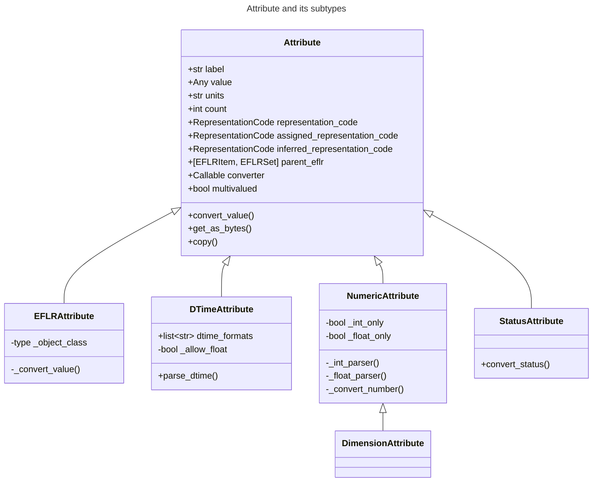

# DLIS Writer

Welcome to `dlis-writer`, possibly the only public Python library for creating DLIS files.

## Table of contents
- [Release log](#release-log)
- [About the DLIS format](#about-the-dlis-format)
- [User guide](#user-guide)
  - [Minimal example](#minimal-example)
  - [Extending basic metadata](#extending-basic-metadata)
  - [Adding more objects](#adding-more-objects)
  - [Example scripts](#example-scripts)
- [Developer guide](#developer-guide)
  - [More details about the format](#more-details-about-the-format)
  - [Storage Unit Label](#storage-unit-label)
  - [IFLR objects](#iflr-objects)
  - [EFLR objects](#eflr-objects)
    - [`EFLRSet` and `EFLRItem`](#eflrset-and-eflritem)
    - [Implemented EFLR objects](#implemented-eflr-objects)
    - [Relations between EFLR objects](#relations-between-eflr-objects)
  - [DLIS Attributes](#dlis-attributes)
    - [The `Attribute` class](#the-attribute-class)
    - [Attribute subtypes](#attribute-subtypes)
  

---
## Release log
TODO

---
## About the DLIS format
DLIS (Digital Log Information Standard) is a binary data format dedicated to storing well log data. 
It was developed in the 1980's, when data were stored on magnetic tapes.
Despite numerous advances in the field of information technology, DLIS is still prevalent in the oil and gas industry.

A DLIS file is composed of _logical records_ - topical units containing pieces of data and/or metadata. 
There are multiple subtypes of logical records which are predefined for specific types of (meta)data.
The most important ones are mentioned below, with links to more extensive descriptions 
in the [Developer guide](#developer-guide).

Every DLIS file starts with a logical record called [_Storage Unit Label (SUL)_](#storage-unit-label),
followed by a [_File Header_](#file-header). Both of these mainly contain format-specific metadata.

A file must also have at least one [_Origin_](#origin), which holds the key information 
about the scanned well, scan procedure, producer, etc.

Numerical data are kept in a [_Frame_](#frame), composed of several [_Channels_](#channel).
A channel can be interpreted as a single curve ('column' of data) or a single image (2D data).

Additional metadata can be specified using dedicated logical records subtypes, 
such as [Parameter](#parameter), [Zone](#zone), [Calibration](#calibration), [Equipment](#equipment), etc.
See [the list](#implemented-eflr-objects) for more details. 
Additionally, for possible relations between the different objects, 
see the relevant [class diagrams](#relations-between-eflr-objects).

---
## User guide
In the sections below you can learn how to define and write a DLIS file using the `dlis-writer`.

### Minimal example
Below you can see a very minimal DLIS file example with two 1D channels (one of which serves as the index)
and a single 2D channel.

```python
import numpy as np  # for creating mock datasets
from dlis_writer.file import DLISFile  # the main dlis-writer object you will interact with

# create a DLISFile object
# this also initialises StorageUnitLabel, FileHeader, and Origin with minimal default information
df = DLISFile()

# number of rows for creating the datasets
# all datasets (channels) belonging to the same frame must have the same number of rows
n_rows = 100

# define channels with numerical data and additional information
#  1) the first channel is also the index channel of the frame;
#     must be 1D, ideally should be monotonic and equally spaced
ch1 = df.add_channel('DEPTH', data=np.arange(n_rows) / 10, units='m')

#  2) second channel; in this case 1D and unitless
ch2 = df.add_channel("RPM", data=(np.arange(n_rows) % 10).astype(float))

#  3) third channel - an image channel (2D data)
ch3 = df.add_channel("AMPLITUDE", data=np.random.rand(n_rows, 5))

# define frame, referencing the above defined channels
main_frame = df.add_frame("MAIN FRAME", channels=(ch1, ch2, ch3), index_type='BOREHOLE-DEPTH')

# when all the required objects have been added, write the data and metadata to a physical DLIS file
df.write('./new_dlis_file.DLIS')

```

### Extending basic metadata
As mentioned above, initialising `DLISFile` object automatically constructs Storage Unit Label,
File Header, and Origin objects. However, the definition of each of these can be further tuned.

The relevant information can be passed either as a relevant pre-defined object or a dictionary
of key-word arguments to create one.

```python
from dlis_writer.file import DLISFile
from dlis_writer.logical_record.misc.storage_unit_label import StorageUnitLabel
from dlis_writer.logical_record.eflr_types.origin import OriginItem

# pre-defining Storage Unit Label as object
sul = StorageUnitLabel(set_identifier='MY-SET', sequence_number=5, max_record_length=4096)

# pre-defining File Header as dictionary
file_header = {'identifier': 'MY-FILE-HEADER', 'sequence_number': 5}

# pre-defining Origin as object
origin = OriginItem(
    'MY-ORIGIN',
    file_id='MY-FILE-ID',
    file_set_name='MY-FILE-SET-NAME',
    file_set_number=11,  # you should always define a file set number when defining OriginItem separately
    file_number=22,
    well_id=55,
    well_name='MY-WELL'
)

# defining DLISFile using the pre-defined objects/dictionaries
df = DLISFile(storage_unit_label=sul, file_header=file_header, origin=origin)
```

The attributes can also be changed later by accessing the relevant objects.
Note: because most attributes are instances of [`Attribute` class](#the-attribute-class),
you will need to use `.value` of the attribute you may want to change.

```python
origin.company.value = "COMPANY X"  # directly through the pre-defined Origin object
df.origin.producer_name.value = "PRODUCER Y"  # by accessing the Origin object through the DLISFile
```

### Adding more objects
Adding other logical records to the file is done in the same way as adding channels and frames.
For example, to add a zone (in depth or in time):

```python
zone1 = df.add_zone('DEPTH-ZONE', domain='BOREHOLE-DEPTH', minimum=2, maximum=4.5)
zone2 = df.add_zone('TIME-ZONE', domain='TIME', minimum=10, maximum=30)
```

To specify units for numerical values, use `.units` of the relevant attribute, e.g.
```python
zone1.minimum.units = 'in'  # inches  
zone2.maximum.units = 's'   # seconds
```

As per the [logical records relations graph](#relations-between-eflr-objects),
Zone objects can be used to define e.g. Splice objects (which also refer to Channels):

```python
splice1 = df.add_splice('SPLICE1', input_channels=(ch1, ch2), output_channel=ch3, zones=(zone1, zone2))
```

For more objects, see [the example with all kinds of objects](./examples/create_synth_dlis.py)
and [the description of all implemented objects](#implemented-eflr-objects).

Definition of all additional objects should precede the call to `.write()` of `DLISFile`, 
otherwise no strict order is observed.

### Example scripts
Scripts in the [examples](./examples) folder illustrate the basic usage of the library.

- [create_synth_dlis.py](./examples/create_synth_dlis.py) shows how to add every kind 
of DLIS object to the file - including Parameters, Equipment, Comments, No-Formats, etc.
It is also shown how multiple frames (in this case, a depth-based and a time-based frame) can be defined.

- [create_dlis_from_data.py](./examples/create_dlis_from_data.py) can be used to make a DLIS file
from any HDF5 data source.

- [create_synth_dlis_variable_data.py](./examples/create_synth_dlis_variable_data.py) allows creating DLIS files
with any number of 2D datasets with a user-defined shape, filled with randomised data. 

---
## Developer guide
TODO

### More details about the format
TODO; division: SUL, IFLR, EFLR; visible records vs logical records

### Logical Records and Visible Records
[As mentioned before](#about-the-dlis-format), DLIS file consists of multiple _logical records_ (LRs).
They can be viewed as abstract units, containing a specific type of data and/or metadata.

In a more physical sense, a DLIS file is divided into _visible records_ (VRs). They are byte structures
of pre-defined format, consisting of a 4-byte header (which includes a visible record start mark and record length)
and a body (which can be filled with any bytes carrying data and/or metadata, coming from the 
logical records).

Visible records have a limited length, which is often lower than that of logical records. 
In this case, the contents of a logical record can be split among several visible records' bodies.
The _logical record segments_ (parts of the split logical record) contain additional 
header information indicating e.g. whether the given segment is the first and/or the last one 
of the original logical record.
(In case a logical record fits entirely into a single visible record, its body is also wrapped
in a logical record segment structure, with indication that the given segment is both 
the first and the last part of the original logical record.)

The maximum length of a VR is defined in [StorageUnitLabel](#storage-unit-label).
According to the standard, the minimum length is not explicitly defined, but because the
minimum length of a LR segment is 16 bytes (including 4 LR segment header bytes),
the resulting minimum length of a VR is 20 bytes.

### Storage Unit Label
Storage Unit Label (SUL) takes up the first 80 bytes of each DLIS file.
Its format is different from that of other logical record types.

The attribute `max_record_length` of SUL determines the maximum length allowed for visible
records of the file (see [Logical Records and Visible Records](#logical-records-and-visible-records)),
expressed in bytes. This number is limited to 16384 and the default is 8192.

### IFLR objects
TODO

### EFLR objects
TODO

#### `EFLRSet` and `EFLRItem`
TODO

#### Implemented EFLR objects
TODO

  ##### File Header
  File Header must immediately follow a [Storage Unit Label](#storage-unit-label) of the file.  
  Its length must be exactly 124 bytes.
  The `identifier` attribute of the File Header represents the name of the DLIS file. 
  It should be a string of max 65 characters.

  ##### Origin
  Every DLIS file must contain at least one Origin. Usually, it immediately follows the [File Header](#file-header).
  The Origin keeps key information related to the scanned well, the scan procedure, producer, etc.
  The `creation_time` attribute of Origin, if not explicitly specified, is set to the current
  date and time (when the object is initialised).

  While in general the standard permits multiple Origins, 
  the current implementation only allows a single Origin per file.
  This is because every object in the file must have an _origin reference_ assigned and at the moment,
  the `file_set_number` of the single Origin of the file is used as the origin reference for all objects
  (see `_assign_origin_reference` in [DLISWriter](./src/dlis_writer/file/writer.py)).
  To allow multiple Origins, one must develop a transparent way os assigning varying origin references
  to all DLIS objects.

  ##### Channel
  TODO
  
  ##### Frame
  TODO

  ##### Axis
  TODO

  ##### Calibration Coefficient
  TODO

  ##### Calibration Measurement
  TODO

  ##### Calibration
  TODO

  ##### Computation
  TODO
  
  ##### Equipment
  TODO

  ##### Group
  TODO
  
  ##### Long Name
  TODO
  
  ##### Message
  TODO
  
  ##### Comment
  TODO

  ##### No-Format
  TODO
  
  ##### Parameter
  TODO
  
  ##### Path
  TODO

  ##### Process
  TODO

  ##### Splice
  TODO

  ##### Tool
  TODO

  ##### Well Reference Point
  TODO
  
  ##### Zone
  TODO

#### Relations between EFLR objects
Many of the EFLR objects are interrelated - e.g. a Frame refers to multiple Channels,
each of which can have an Axis; a Calibration uses Calibration Coefficients and Calibration Measurements;
a Tool has Equipments as parts. The relations are summarised in the diagram below.

_*Note*: in the diagrams below, the description of [`Attribute`s](#dlis-attributes) of the objects has been simplified.
Only the type of the `.value` part of each `Attribute` is shown - e.g. in `CalibrationItem`, 
`calibrated_channels` is shown as a list of `ChannelItem` instances, where in fact it is 
an [`EFLRAttribute`](#attribute-subtypes) whose `.value` takes the form of a list of `ChannelItem` objects._ 


Other EFLR objects can be thought of as _standalone_ - they do not refer to other EFLR objects 
and are not explicitly referred to by any (although - as in case of NoFormat - a relation to IFLR objects can exist).


A special case is a Group object, which can refer to multiple other EFLR objects of a given type.
It can also keep references to other groups, creating a hierarchical structure.


### DLIS Attributes
The characteristics of EFLR objects of the DLIS are defined using instances of `Attribute` class.
An `Attribute` holds the value of a given parameter together with the associated unit (if any)
and a representation code which guides how the contained information is transformed to bytes.
Allowed units (not a strict set) and representation codes are defined [in the code](./src/dlis_writer/utils/enums.py).

As a rule, `Attribute`s are defined for `EFLRItem`s, instances of which populate the `Attribute`s
with relevant values. When an `EFLRItem` is converted to bytes, it includes information from all its
`Attributes`. However, the defined `Attribute` information is also needed in `EFLRSet`s in order to define
a header for all `EFLRItem`s it contains. For this reason, when the first `EFLRItem` instance for a given
`EFLRSet` is created, the `Attribute`s from this `EFLRItem` are copied and passed to `ELFRSet`.

#### The `Attribute` class
The main characteristics of `Attribute` are described below.

- `label`: The name of the `Attribute`. Comes from the standard and should not be changed.
- `value`: The value(s) specified for this `Attribute`. In general, any type is allowed, but in most cases it is
  (a list of): str / int / float / `EFLRItem` / `datetime`.
- `multivalued`: a Boolean indicating whether this `Attribute` instance accepts a list of values (if True) or a single 
  value (if False). Specified at initialisation of the `Attribute` (which usually takes place at initialisation of the 
  relevant EFLR object).
- `count`: Number of values specified for the `Attribute` instance. If the `Attribute` is not `multivalued`, `count` is 
  always 1. Otherwise, it is the length of the list of values added to the `Attribute` (or `None` if no value is given).
- `units`: A string representing the units of the `value` of the `Attribute` - if relevant. The standard pre-defines
  a list of allowed units, but many DLIS readers accept any string value. For this reason, only a log warning is issued
  if the user specifies a unit other than those given by the standard. 
- `representation_code`: indication of type of the value(s) of the `Attribute` and guidance on how they should be 
  converted to bytes to be included in the file. The standard pre-defines representation codes for some 
  of the `Attribute`s and leaves more-or-less free choice for others. For this reason, many `Attribute`s have the 
  representation code specified at initialisation and once explicitly specified, the representation code 
  cannot be changed. The `representation_code` is a `property` which returns either the explicitly passed code (if any)
  or one inferred from the `Attribute`'s `value` (if possible); if none of these can be determined, 
  the property returns `None`.
- `assigned_representation_code`: The explicitly specified (at initialisation or later) representation code 
  of the `Attribute`. 
- `inferred_representation_code`: A representation code inferred from the `value` of the `Attribute`, if possible.
- `parent_eflr`: The `EFLRItem` or `EFLRSet` instance this attribute belongs to. Mainly used for string representation
  of the `Attribute` (e.g. `Attribute 'description' of ToolItem 'TOOL-1'`, where `TOOL-1` is the parent EFLR).
- `converter`: A callable which is used to convert the value passed by the user (or each of the individual items 
  if the `Attribute` is multivalued) to fit the standard-imposed requirements for the given `Attribute`. It can also 
  include type checks etc. (for example, checking that the objects passed to `calibrated_channels` of `CalibrationItem`)
  are all instances of `ChannelItem`.

_Settable_ parts of `Attribute` instance include: `value`, `units`, `representation_code` 
(stored as `assigned_representation_code`), and `converter`. Some subtypes of `Attribute` further restrict 
what can be set.


#### Attribute subtypes
Several `Attribute` subclasses have been defined to answer the reusable characteristics of the 
attributes needed for various EFLR objects. The overview can be seen in the diagram below.



`EFLRAttribute` has been defined to deal with attributes which should keep reference to other
`EFLRItem`s - for example, `Channel`s of `Frame`, `Zones` of `Splice`, 
`CalibrationCoefficient`s and `CalibrationMeasurement`s of `Calibration`.
The value of an `EFLRAttribute` is an instance of (usually specific subtype of) `EFLRItem`.
The representation code can be either `OBNAME` or `OBJREF`. The unit should not be defined (is meaningless).

`DTimeAttribute` is meant for keeping time reference, either in the form of a `datetime.datetime` object
or a number, indicating time since a specific event. The representation code should be adapted
to the value: `DTIME` for `datetime` objects, otherwise any numeric code (e.g. `FDOUBl`, `USHORT`, etc.)
The unit should be defined if the value is a number and should express the unit of time
('s' for seconds, 'min' for minutes, etc.).

`NumericAttribute` keeps numerical data - in the form of int(s) or float(s). It is possible
to restrict the type of accepted values to ints only or floats only at initialisation of the attribute.

`DimensionAttribute` is a subclass of `NumericAttribute`. It limits the above to ints only and is always
multivalued (always a list of integers). It is mainly used in [Channel](#channel) objects where it describes
the shape of the data (only the width, i.e. the number of columns).

`StatusAttribute` encodes the status of [Tool](#tool) and [Equipment](#equipment) objects. Its value can only be 0 or 1.


------------------------------------------------

### WELL REFERENCE POINT

Here we did not use *coordinate_3_name* and *coordinate_3_value* fields.

```python

from logical_record.well_reference_point import WellReferencePoint

well_reference_point = WellReferencePoint('AQLN WELL-REF')

well_reference_point.permanent_datum.value = 'AQLN permanent_datu'

well_reference_point.vertical_zero.value = 'AQLN vertical_zero'

well_reference_point.permanent_datum_elevation.value = 1234.51

well_reference_point.above_permanent_datum.value = 888.51

well_reference_point.magnetic_declination.value = 999.51

well_reference_point.coordinate_1_name.value = 'Lattitude'

well_reference_point.coordinate_1_value.value = 40.395240

well_reference_point.coordinate_2_name.value = 'Longitude'

well_reference_point.coordinate_2_value.value = 27.792470

```

### AXIS

```python

from logical_record.axis import Axis

axis = Axis('AXS-1')

axis.axis_id.value = 'FIRST AXIS'

axis.coordinates.representation_code = 'FDOUBL'
axis.coordinates.count = 2
axis.coordinates.value = [40.395241, 27.792471]

axis.spacing.representation_code = 'FDOUBL'
axis.spacing.value = 0.33
axis.spacing.units = 'm'

```

### LONG NAME

```python

from logical_record.long_name import LongName

long_name = LongName('LNAME-1')

long_name.general_modifier.value = 'SOME ASCII TEXT'

long_name.quantity.value = 'SOME ASCII TEXT'

long_name.quantity_modifier.value = 'SOME ASCII TEXT'

long_name.altered_form.value = 'SOME ASCII TEXT'

long_name.entity.value = 'SOME ASCII TEXT'

long_name.entity_modifier.value = 'SOME ASCII TEXT'

long_name.entity_number.value = 'SOME ASCII TEXT'

long_name.entity_part.value = 'SOME ASCII TEXT'

long_name.entity_part_number.value = 'SOME ASCII TEXT'

long_name.generic_source.value = 'SOME ASCII TEXT'

long_name.source_part.value = 'SOME ASCII TEXT'

long_name.source_part_number.value = 'SOME ASCII TEXT'

long_name.conditions.value = 'SOME ASCII TEXT'

long_name.standard_symbol.value = 'SOME ASCII TEXT'

long_name.private_symbol.value = 'SOME ASCII TEXT'

```


### CHANNEL


You can think of Channel as a column.

For example let's say in your dataset, you have a column
called DEPTH, the values are float, the unit is meter, and each cell contains a single value so the dimension
is 1. This is how you would create the Channel for DEPTH column.

```python

from logical_record.channel import Channel

depth_channel = Channel('DEPTH CHANNEL')
depth_channel.long_name.value = 'DEPTH'
depth_channel.properties.value = ['0309 AQLN PROP 1', 'PROP AQLN 2']
depth_channel.representation_code.value = get_representation_code('FDOUBL')
depth_channel.units.value = 'm'
depth_channel.dimension.value = [1]
depth_channel.element_limit.value = [1]

```

*data.csv* has two more columns, we create channels for those as well.

```python

from logical_record.channel import Channel

curve_1_channel = Channel('CURVE 1 CHANNEL')
curve_1_channel.long_name.value = 'CURVE 1'
curve_1_channel.representation_code.value = get_representation_code('FDOUBL')
curve_1_channel.units.value = 't'
curve_1_channel.dimension.value = [1]
curve_1_channel.element_limit.value = [1]

curve_2_channel = Channel('CURVE 2 CHANNEL')
curve_2_channel.long_name.value = 'CURVE 2'
curve_2_channel.representation_code.value = get_representation_code('FDOUBL')
curve_2_channel.units.value = 't'
curve_2_channel.dimension.value = [1]
curve_2_channel.element_limit.value = [1]

```

For multi-dimensional columns, you must specify the dimension field's value accordingly.
Dimension attributes denotes the dimension of the array in a single cell.
For example the *image.csv* file has dimensions (7657, 384). This means,
there are 7657 rows, each containing 384 values. So the dimension will be 384 as
it denotes the dimension of each value in a single cell.


```python

from logical_record.channel import Channel

image_channel = Channel('IMG')
image_channel.long_name.value = 'IMAGE CHANNEL'
image_channel.representation_code.value = get_representation_code('FDOUBL')
image_channel.dimension.value = [384]
image_channel.element_limit.value = [384]

```


### FRAME & FRAME DATA

Each frame can have a varied number of Channel instances.
Frames can be thought as separate spreadsheets with different combinations of Channels (columns)

For each Frame, user must first create a Frame(EFLR) object and afterwards for each row of each column (Channel)
create a Frame Data.


Creating the Frame(EFLR)

```python

from logical_record.frame import Frame

frame = Frame('MAIN')
frame.channels.value = [depth_channel, curve_1_channel, curve_2_channel, image_channel]
frame.index_type.value = 'BOREHOLE-DEPTH'
frame.spacing.value = 0.33
frame.spacing.representation_code = 'FDOUBL'
frame.spacing.units = 'm'

```

Reading data:

```python

import pandas as pd

data = pd.read_csv('./data/data.csv')
image = pd.read_csv('./data/image.csv', header=None, sep=' ')

# Remove index col if exists 
data = data[[col for col in data.columns[1:]]]

# Convert to numpy.ndarray
data = data.values
image = image.values

```

Each FrameData object represents a single row. FrameData must follow the Frame object and the order of the data passed should be the same with
the order of the Channels in Frame.channels.value field.

For this example *frame* is an instance of Frame(EFLR) and has 2 channels: depth_channel and image_channel.

Each frame data should contain depth_channel values followed by image_channel. The data passed to FrameData
must be a 1 dimensional np.array or a list.

In this example the *depth_channel*, *curve_1_channel*, and *curve_2_channel* are instances of Channel (created previously) and all have a dimension of 1.

*image_channel* on the other hand, has a dimension of 384. So, data that will be passed to each FrameData object
must be a list of 387 values, first three being the values of *depth_channel*, *curve_1_channel*, and *curve_2_channel* in the same row.
Following 384 values are the *image_channel* values for the corresponding row.

This example uses numpy's append method to manipulate the datasets to get the list of values passed to FrameData objects.

```python

from logical_record.frame_data import FrameData

frame_data_objects = []

for i in range(len(data)):

    slots = np.append(data[i], image[i])

    frame_data = FrameData(frame=frame, frame_number=i+1, slots=slots)
    frame_data_objects.append(frame_data)

``` 

Please note that, reading & manipulating datasets might differ depending on the format of the data files.

User is expected to create an array for each row and pass that array to FrameData object.


### PATH

*frame_type* must be an instance of a Frame(EFLR) object.
*well_reference_point* must be an instance of a WellReferencePoint(EFLR) object.
*value* must be a list of Channel instances.

```python

from logical_record.path import Path

path_1 = Path('PATH1')

path_1.frame_type.value = frame
path_1.well_reference_point.value = well_reference_point
path_1.value.value = [curve_1_channel, curve_2_channel]

path_1.vertical_depth.value = -187
path_1.vertical_depth.representation_code = 'SNORM'

path_1.radial_drift.value = 105
path_1.radial_drift.representation_code = 'SSHORT'

path_1.angular_drift.value = 64.23
path_1.angular_drift.representation_code = 'FDOUBL'

path_1.time.value = 180
path_1.time.representation_code = 'SNORM'

path_1.depth_offset.value = -123
path_1.depth_offset.representation_code = 'SSHORT'

path_1.measure_point_offset.value = 82
path_1.measure_point_offset.representation_code = 'SSHORT'

path_1.tool_zero_offset.value = -7
path_1.tool_zero_offset.representation_code = 'SSHORT'

```


### ZONE

> [Zone Objects](http://w3.energistics.org/rp66/v1/rp66v1_sec5.html#5_8_1) specify single intervals in depth or time.

Domain attribute can be:

1. BOREHOLE-DEPTH
2. TIME
3. VERTICAL-DEPTH

Maximum and Minimum attributes' representation code will depend on the domain attribute.

A comprehensive example showing 4 different usage of this object:

```python

from datetime import datetime
from logical_record.zone import Zone

# Domain = BOREHOLE-DEPTH
zone_1 = Zone('ZONE-1')
zone_1.description.value = 'BOREHOLE-DEPTH-ZONE'
zone_1.domain.value = 'BOREHOLE-DEPTH'

zone_1.maximum.value = 1300.45
zone_1.maximum.units = 'm'
zone_1.maximum.representation_code = 'FDOUBL'

zone_1.minimum.value = 100
zone_1.minimum.units = 'm'
zone_1.minimum.representation_code = 'USHORT'


# Domain = VERTICAL-DEPTH
zone_2 = Zone('ZONE-2')
zone_2.description.value = 'VERTICAL-DEPTH-ZONE'
zone_2.domain.value = 'VERTICAL-DEPTH'

zone_2.maximum.value = 2300.45
zone_2.maximum.units = 'm'
zone_2.maximum.representation_code = 'FDOUBL'

zone_2.minimum.value = 200
zone_2.minimum.units = 'm'
zone_2.minimum.representation_code = 'USHORT'


# Domain = TIME and values are passed as datetime.datetime instances
zone_3 = Zone('ZONE-3')
zone_3.description.value = 'ZONE-TIME'
zone_3.domain.value = 'TIME'

zone_3.maximum.value = datetime(2022, 7, 13, 11, 30)
zone_3.maximum.representation_code = 'DTIME'

zone_3.minimum.value = datetime(2022, 7, 12, 9, 0)
zone_3.minimum.representation_code = 'DTIME'

# Domain = TIME and values are passed as integers denoting n minutes since something.
zone_4 = Zone('ZONE-4')
zone_4.description.value = 'ZONE-TIME-2'
zone_4.domain.value = 'TIME'

zone_4.maximum.value = 90
zone_4.maximum.units = 'minute'
zone_4.maximum.representation_code = 'USHORT'

zone_4.minimum.value = 10
zone_4.minimum.units = 'minute'
zone_4.minimum.representation_code = 'USHORT'

```

### PARAMETER

Example usage

```python

from logical_record.parameter import Parameter

parameter_1 = Parameter('PARAM-1')

parameter_1.long_name.value = 'LATLONG-GPS'

parameter_1.dimension.value = [1]

parameter_1.zones.value = [zone_1, zone_3]

parameter_1.values.value = ["40deg 23' 42.8676'' N", "40deg 23' 42.8676'' N"]
parameter_1.values.representation_code = 'ASCII'

```


### EQUIPMENT

Please note that even though RP66 V1 does not restrict the representation code for the attributes listed below, to make it easier for the user
their default representation codes are set to FDOUBL. This object is an exception where you can set the representation codes even though they are not None in the logical_record.utils.rp66.RP66.

- height
- length
- minimum_diameter
- maximum_diameter
- volume
- weight
- hole_size
- pressure
- temperature
- vertical_depth
- radial_drift
- angular_drift


```python

from logical_record.equipment import Equipment

equipment = Equipment('EQ1')
equipment.trademark_name.value = 'EQ-TRADEMARKNAME'
equipment.status.value = 1
equipment._type.value = 'Tool'
equipment.serial_number.value = '9101-21391'
equipment.location.value = 'Well'

equipment.height.value = 140
equipment.height.units = 'in' 

equipment.length.value = 230.78
equipment.length.units = 'cm'

equipment.minimum_diameter.value = 2.3
equipment.minimum_diameter.units = 'm'

equipment.maximum_diameter.value = 3.2
equipment.maximum_diameter.units = 'm'

equipment.volume.value = 100
equipment.volume.units = 'cm3'

equipment.weight.value = 1.2
equipment.weight.units = 't'

equipment.hole_size.value = 323.2
equipment.hole_size.units = 'm' 

equipment.pressure.value = 18000
equipment.pressure.units = 'psi' 

equipment.temperature.value = 24
equipment.temperature.units = 'degC' 

equipment.vertical_depth.value = 587
equipment.vertical_depth.units = 'm'

equipment.radial_drift.value = 23.22
equipment.radial_drift.units = 'm' 

equipment.angular_drift.value = 32.5
equipment.angular_drift.units = 'm'

```


### TOOL

*parts* attribute is a list of Equipment object instances.
*channels* attribute is a list of Channel objects.
*parameters* attribute is a list of Parameter objects.


```python

from logical_record.tool import Tool

tool = Tool('TOOL-1')
tool.description.value = 'SOME TOOL'
tool.trademark_name.value = 'SMTL'
tool.generic_name.value = 'TOOL GEN NAME'
tool.parts.value = [equipment_1, equipment_2]
tool.status.value = 1
tool.channels.value = [depth_channel, curve_1_channel]
tool.parameters.value = [parameter_1, parameter_3]

```


### COMPUTATION

*axis* attribute must be an Axis object

*zones* attribute must be a list of Zone objects

*values* attribute must contain a list of values. Note that the number of values MUST BE THE SAME with number of Zone objects in the *zones* attribute.
Representation code of *values* must be specified.

*source* attribute can be a reference to another object that is the direct source of this computation.
There are two representation codes that can be used for referencing an object: 'OBNAME' and 'OBJREF'.
Below example assigns a Tool object created before as the *source* and sets the representation code to 'OBNAME'.


```python

from logical_record.computation import Computation

computation = Computation('COMPT-1')

computation.long_name.value = 'COMPT 1'

computation.properties.value = ['PROP 1', 'AVERAGED']

computation.dimension.value = [1]

computation.axis.value = axis

computation.zones.value = [zone_1, zone_2, zone_3]

computation.values.value = [100, 200, 300]
computation.values.representation_code = 'UNORM'

computation.source.value = tool
computation.source.representation_code = 'OBNAME'

```


### PROCESS

*status* attribute can take 3 values:

1. COMPLETE
2. ABORTED
3. IN-PROGRESS

*input_channels*, *output_channels*, *input_computations*, *output_computations*, and *parameters* attributes are list of related object instances.

```python

from logical_record.process import Process

process_1 = Process('MERGED')

process_1.description.value = 'MERGED'

process_1.trademark_name.value = 'PROCESS 1'

process_1.version.value = '0.0.1'

process_1.properties.value = ['AVERAGED']

process_1.status.value = 'COMPLETE'

process_1.input_channels.value = [curve_1_channel]

process_1.output_channels.value = [multi_dim_channel]

process_1.input_computations.value = [computation_1]

process_1.output_computations.value = [computation_2]

process_1.parameters.value = [parameter_1, parameter_2, parameter_3]

process_1.comments.value = 'SOME COMMENT HERE'

```


### CALIBRATION MEASUREMENT

```python
from logical_record.calibration import CalibrationMeasurement

calibration_measurement_1 = CalibrationMeasurement('CMEASURE-1')

calibration_measurement_1.phase.value = 'BEFORE'

calibration_measurement_1.measurement_source.value = depth_channel

calibration_measurement_1._type.value = 'Plus'

calibration_measurement_1.dimension.value = [1]

calibration_measurement_1.measurement.value = [12.2323]
calibration_measurement_1.measurement.representation_code = 'FDOUBL'

calibration_measurement_1.sample_count.value = [12]
calibration_measurement_1.sample_count.representation_code = 'USHORT'

calibration_measurement_1.maximum_deviation.value = [2.2324]
calibration_measurement_1.maximum_deviation.representation_code = 'FDOUBL'

calibration_measurement_1.standard_deviation.value = [1.123]
calibration_measurement_1.standard_deviation.representation_code = 'FDOUBL'

calibration_measurement_1.begin_time.value = datetime.now()
calibration_measurement_1.begin_time.representation_code = 'DTIME'

calibration_measurement_1.duration.value = 15
calibration_measurement_1.duration.representation_code = 'USHORT'
calibration_measurement_1.duration.units = 's'

calibration_measurement_1.reference.value = [11]
calibration_measurement_1.reference.representation_code = 'USHORT'

calibration_measurement_1.standard.value = [11.2]
calibration_measurement_1.standard.representation_code = 'FDOUBL'

calibration_measurement_1.plus_tolerance.value = [2]
calibration_measurement_1.plus_tolerance.representation_code = 'USHORT'

calibration_measurement_1.minus_tolerance.value = [1]
calibration_measurement_1.minus_tolerance.representation_code = 'USHORT'
```


### CALIBRATION COEFFICIENT


```python
from logical_record.calibration import CalibrationCoefficient

calibration_coefficient = CalibrationCoefficient('COEF-1')

calibration_coefficient.label.value = 'Gain'

calibration_coefficient.coefficients.value = [100.2, 201.3]
calibration_coefficient.coefficients.representation_code = 'FDOUBL'

calibration_coefficient.references.value = [89, 298]
calibration_coefficient.references.representation_code = 'FDOUBL'

calibration_coefficient.plus_tolerances.value = [100.2, 222.124]
calibration_coefficient.plus_tolerances.representation_code = 'FDOUBL'

calibration_coefficient.minus_tolerances.value = [87.23, 214]
calibration_coefficient.minus_tolerances.representation_code = 'FDOUBL'
```


### CALIBRATION

```python
from logical_record.calibration import Calibration

calibration = Calibration('CALB-MAIN')

calibration.calibrated_channels.value = [depth_channel, curve_1_channel]

calibration.uncalibrated_channels.value = [curve_2_channel, multi_dim_channel, image_channel]

calibration.coefficients.value = [calibration_coefficient]

calibration.measurements.value = [calibration_measurement_1]

calibration.parameters.value = [parameter_1, parameter_2, parameter_3]

calibration.method.value = 'Two-Point-Linear'
```


### GROUP

```python
from logical_record.group import Group

group_1 = Group('GRP-1')

group_1.description.value = 'MULTI-DIMENSIONAL CHANNELS'
group_1.item_type.value = 'CHANNEL'
group_1.object_list.value = [multi_dim_channel, image_channel]

```


### SPLICE
```python
from logical_record.splice import Splice

splice_1 = Splice('SPLICE-1')
splice_1.output_channels.value = multi_dim_channel
splice_1.input_channels.value = [curve_1_channel, curve_2_channel]
splice_1.zones.value = [zone_1, zone_2, zone_3, zone_4]

```


### NO-FORMAT EFLR & FRAME DATA

NO-FORMAT Logical Records allow users to write arbitrary bytes data.

There are 2 steps:

1. Creating NoFormat(EFLR) objects
2. Creatinf NOFORMAT Frame Data that points to a NoFormat(EFLR) object


#### NoFormat (EFLR)

This object can be thought of a parent class for the NoFormat FrameData(s).
This example creates two NoFormat objects:


```python
from logical_record.no_format import NoFormat

no_format_1 = NoFormat('no_format_1')
no_format_1.consumer_name.value = 'SOME TEXT NOT FORMATTED'
no_format_1.description.value = 'TESTING-NO-FORMAT'

no_format_2 = NoFormat('no_format_2')
no_format_2.consumer_name.value = 'SOME IMAGE NOT FORMATTED'
no_format_2.description.value = 'TESTING-NO-FORMAT-2'

```

#### NOFORMAT FRAME DATA (IFLR)

NOFORMAT FrameData only has two attributes:

1. no_format_object: A logical_record.no_format.NoFormat instance
2. data: a binary data


An arbitrary number of NOFORMAT FrameData can be created.

This example creates three NOFORMAT FrameData, two of them points to no_format_1,
and one of them to no_format_2 objects that were created in the previous step.

```python
from logical_record.frame_data import FrameData

no_format_fdata_1 = NoFormatFrameData()
no_format_fdata_1.no_format_object = no_format_1
no_format_fdata_1.image1 = 'Some text that is recorded but never read by anyone.'

no_format_fdata_2 = NoFormatFrameData()
no_format_fdata_2.no_format_object = no_format_1
no_format_fdata_2.image1 = 'Some OTHER text that is recorded but never read by anyone.'

no_format_fdata_3 = NoFormatFrameData()
no_format_fdata_3.no_format_object = no_format_2
no_format_fdata_3.image1 = 'This could be the BINARY data of an image rather than ascii text'

```

#### COMPLETE CODE

```python
from logical_record.no_format import NoFormat
from logical_record.frame_data import NoFormatFrameData

no_format_1 = NoFormat('no_format_1')
no_format_1.consumer_name.value = 'SOME TEXT NOT FORMATTED'
no_format_1.description.value = 'TESTING-NO-FORMAT'

no_format_2 = NoFormat('no_format_2')
no_format_2.consumer_name.value = 'SOME IMAGE NOT FORMATTED'
no_format_2.description.value = 'TESTING-NO-FORMAT-2'

no_format_fdata_1 = NoFormatFrameData()
no_format_fdata_1.no_format_object = no_format_1
no_format_fdata_1.data = 'Some text that is recorded but never read by anyone.'

no_format_fdata_2 = NoFormatFrameData()
no_format_fdata_2.no_format_object = no_format_1
no_format_fdata_2.data = 'Some OTHER text that is recorded but never read by anyone.'

no_format_fdata_3 = NoFormatFrameData()
no_format_fdata_3.no_format_object = no_format_2
no_format_fdata_3.data = 'This could be the BINARY data of an image rather than ascii text'

```


### MESSAGE

*time* attribute can be passed as a datetime.datetime instance or as a numeric value that denotes
x min/sec/hour/ since something.

```python
from logical_record.message import Message

message_1 = Message('MESSAGE-1')
message_1._type.value = 'Command'

message_1.time.value = datetime.now()
message_1.time.representation_code = 'DTIME'

message_1.borehole_drift.value = 123.34
message_1.borehole_drift.representation_code = 'FDOUBL'

message_1.vertical_depth.value = 234.45
message_1.vertical_depth.representation_code = 'FDOUBL'

message_1.radial_drift.value = 345.56
message_1.radial_drift.representation_code = 'FDOUBL'

message_1.angular_drift.value = 456.67
message_1.angular_drift.representation_code = 'FDOUBL'

message_1.text.value = 'Test message 11111'

```


### COMMENT

```python
from logical_record.message import Comment

comment_1 = Comment('COMMENT-1')
comment_1.text.value = 'SOME COMMENT HERE'

comment_2 = Comment('COMMENT-2')
comment_2.text.value = 'SOME OTHER COMMENT HERE'

```


### CREATING DLIS FILE

First step is to create a DLISFile object.

Each DLIS File must have a Storage Unit Label, File Header and an Origin.
All other Logical Records must have an attribute *origin_reference* that points to the
related Origin object's *file_set_number*. So, rather than setting some_logical_record.origin_reference
each time user creates a Logical Record, the Origin object is passed to __init__ of the DLISFile
and *origin_reference*s of all Logical Records are set internally.

*file_path*: The path of the DLIS file that will be written to.
*storage_unit_label*: A logical_record.storage_unit_label.StorageUnitLabel instance.
*file_header*: A logical_record.file_header.FileHeader instance.
*origin*: A logical_record.origin.Origin instance.

Below example uses the same variable names used in previous steps to create each Logical Record Segment.

For example *sul* is the name that we used when creating the StorageUnitLabel object.

```python
from logical_record.file import DLISFile

dlis_file = DLISFile(file_path='./output/test.DLIS',
                     storage_unit_label=sul,
                     file_header=file_header,
                     origin=origin)
```

Next step is to append all the Logical Record Segments created in previous segments.
This is done by appending the related object instances to *logical_records* attribute of the DLISFile object.


```python

dlis_file.logical_records.append(well_reference_point)
dlis_file.logical_records.append(axis)
dlis_file.logical_records.append(long_name)
dlis_file.logical_records.append(depth_channel)
dlis_file.logical_records.append(curve_1_channel)
dlis_file.logical_records.append(curve_2_channel)
dlis_file.logical_records.append(multi_dim_channel)
dlis_file.logical_records.append(image_channel)

dlis_file.logical_records.append(frame)
for fdata in frame_data_objects:
    dlis_file.logical_records.append(fdata)

dlis_file.logical_records.append(path_1)
dlis_file.logical_records.append(zone_1)
dlis_file.logical_records.append(zone_2)
dlis_file.logical_records.append(zone_3)
dlis_file.logical_records.append(zone_4)
dlis_file.logical_records.append(parameter_1)
dlis_file.logical_records.append(parameter_2)
dlis_file.logical_records.append(parameter_3)
dlis_file.logical_records.append(equipment_1)
dlis_file.logical_records.append(equipment_2)
dlis_file.logical_records.append(tool)
dlis_file.logical_records.append(computation_1)
dlis_file.logical_records.append(computation_2)
dlis_file.logical_records.append(process_1)
dlis_file.logical_records.append(process_2)
dlis_file.logical_records.append(calibration_measurement_1)
dlis_file.logical_records.append(calibration_coefficient)
dlis_file.logical_records.append(calibration)
dlis_file.logical_records.append(group_1)
dlis_file.logical_records.append(splice_1)
dlis_file.logical_records.append(no_format_1)
dlis_file.logical_records.append(no_format_2)
dlis_file.logical_records.append(no_format_fdata_1)
dlis_file.logical_records.append(no_format_fdata_2)
dlis_file.logical_records.append(no_format_fdata_3)
dlis_file.logical_records.append(message_1)
dlis_file.logical_records.append(comment_1)
dlis_file.logical_records.append(comment_2)

```

Adding all the logical records at the last step was an arbitrary decision made for demonstration purposes.

A more intuitive way might be:

1. Create StorageUnitLabel
2. Create FileHeader
3. Create Origin
4. Create DLISFile
5. Create other Logical Records and append them to DLISFile().logical_records on the fly

A basic demonstration of this approach:

```python
... imports
..
.

sul = StorageUnitLabel()
file_header = FileHeader()
origin = Origin()
... origin attributes
..
.

dlis_file = DLISFile(file_path='some_path.DLIS', sul, file_header, origin)


well_reference_point = WellReferencePoint()
... well_reference_point attributes
..
.

dlis_file.logical_records.append(well_reference_point)


channel = Channel()
... channel attributes
..
.

dlis_file.logical_records.append(channel)
```


## DLIS objects


